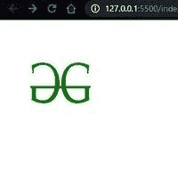

# 如何用 HTML5 指定文档中所有相对 URL 的基础 URL？

> 原文:[https://www . geesforgeks . org/如何使用-html5 指定文档中所有相对 url 的基本 URL/](https://www.geeksforgeeks.org/how-to-specify-the-base-url-for-all-relative-urls-in-a-document-using-html5/)

当你硬编码了每一个 href 的时候，在迁移时改变 URL 或者维护页面上的每一个 URL 是一个很大的努力，所以拥有一个根/基 URI 并使用所有资源的相对路径是一个更好的选择。

**使用[T4>基地](https://www.geeksforgeeks.org/html-base-tag/)标签:**

1.  标签必须位于和标签内。
2.  您应该在一个 HTML 页面上只使用一次标签。如果您多次使用它，只有第一个将被验证，其余的将被忽略。
3.  标记是自结束标记，所以不应该使用结束标记
4.  建议在根 URI 后使用正斜杠“/”。

**语法:**

```html
<base href="http://example.com/">
```

或者

```html
<base target="_blank" href="http://example.com/">
```

**示例:**如果您希望在新选项卡中打开链接，请按照下面的代码操作。

在下面的代码中，我们将“https://www.geeksforgeeks.org/”设置为页面上每个相对 URL 的根 URL。“java 入门/”将打开“https://www . geesforgeks . org/Java 入门/”网页，“Java-basic-语法/”将打开浏览器的“https://www . geesforgeks . org/Java-basic-语法/”。

## 超文本标记语言

```html
<!DOCTYPE html>
<html>
<head>
    <base href="https://www.geeksforgeeks.org/" >
</head>
<body>
    <a href="introduction-to-java/">Intro To Java</a>
    <br>
    <a href="java-basic-syntax/">Java Basic syntax</a>
</body>
</html>
```

**输出:**


使用 URL 基准

**示例 2:** 在以下示例中，基本 URL 设置为“*http://127 . 0 . 0 . 1:5500/img/*，因此当图像文件包含在 *img* 标签中时，图像将从 *localhost 加载。*

## 超文本标记语言

```html
<!DOCTYPE html>
<html>
<head>
    <base href="http://127.0.0.1:5500/img/" >
</head>
<body>
    
</body>
</html>
```

**输出:**


**例 2:** 下例中，根设置为“*https://media . geesforgeeks . org/WP-content/cdn-uploads/20200617163105/*，从*geesforgeeks*服务器加载图像文件“gfg-logo.png”。

## 超文本标记语言

```html
<!DOCTYPE html>
<html>
<head>
    <base href=
"https://media.geeksforgeeks.org/wp-content/cdn-uploads/20200617163105/">
</head>
<body>
    
</body>
</html>
```

**输出:**



因此，如果您要使用基本标签，请确保您要使用相对路径访问的所有资源都在同一个服务器上，否则浏览器会误解您的资源。