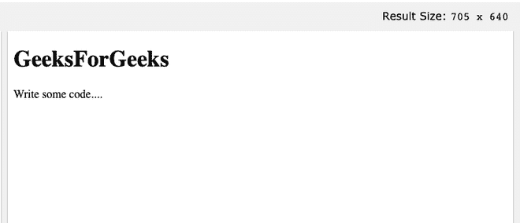

# 如何在 HTML5 中指定外部脚本文件中使用的字符编码？

> 原文:[https://www . geesforgeks . org/如何指定在外部脚本文件中使用的字符编码 html5/](https://www.geeksforgeeks.org/how-to-specify-the-character-encoding-used-in-an-external-script-file-in-html5/)

要在 HTML5 中指定外部脚本文件中使用的字符编码，我们使用 

**语法:**

```html
<meta charset="">
<script charset="">
```

**属性值:**以下是为外部脚本指定字符编码的值。

*   **ISO-8859-1:** 用于指定拉丁字母的标准编码。
*   **UTF-8:** 用于指定 Unicode 的字符编码。

**示例:**下面的示例使用 *meta* 标记说明了**字符集属性**的使用。

## 超文本标记语言

```html
<!DOCTYPE html>
<html>

<head>
  <meta charset="UTF-8">
</head>

<body>
  <h1>GeeksForGeeks</h1>

<p>Write some code....</p>

</body>

</html>
```

**输出:**



元示例