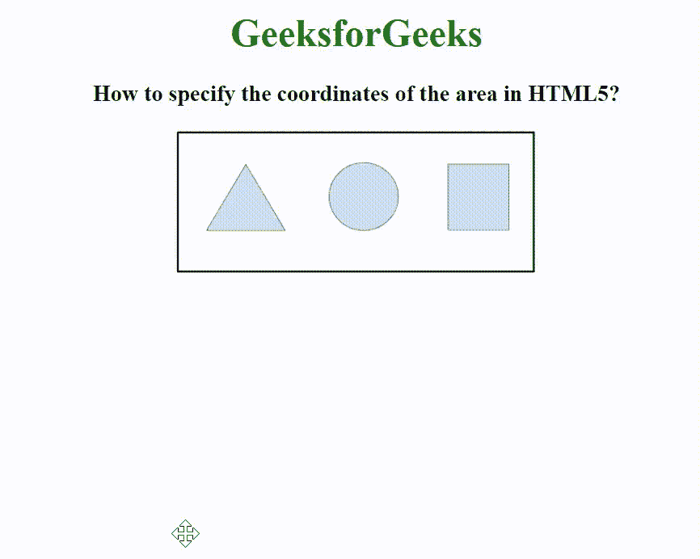

# 如何在 HTML5 中指定一个区域的坐标？

> 原文:[https://www . geesforgeks . org/如何在 html5 中指定区域坐标/](https://www.geeksforgeeks.org/how-to-specify-the-coordinates-of-an-area-in-html5/)

在本文中，我们将看到如何在 HTML5 中设置元素的坐标。<区域>的[坐标属性](https://www.geeksforgeeks.org/html-coords-attribute/)用于指定影像地图中某个区域的坐标。shape 属性用于指定区域的大小、形状和位置。坐标(0，0)表示草图的左上角。

**语法:**

```html
<area coords="value">
```

**示例:**在此示例中，用形状参数和坐标指定了三个形状区域，以便可以单击它们来查看形状。

## 超文本标记语言

```html
<!DOCTYPE html>
<html>
<head>
  <style>
    body {
      text-align: center;
    }

    h1 {
      color: green;
    }
  </style>
</head>
<body>
  <h1>GeeksforGeeks</h1>
  <h3>
    How to specify the coordinates
    of the area in HTML5?
  </h3>
  

  <map name="shapemap">

    <!-- area tag contained image. -->
    <area shape="poly"
          coords="59, 31, 28, 83, 91, 83"
          href=
"https://media.geeksforgeeks.org/wp-content/uploads/20190227165802/area2.png" 
          alt="Triangle">

    <area shape="circle" 
          coords="155, 56, 26"
          href=
"https://media.geeksforgeeks.org/wp-content/uploads/20190227165934/area3.png"
          alt="Circle">

    <area shape="rect" 
          coords="224, 30, 276, 82"
          href=
"https://media.geeksforgeeks.org/wp-content/uploads/20190227170021/area4.png"
          alt="Square">
  </map>
</body>
</html>
```

**输出:**

