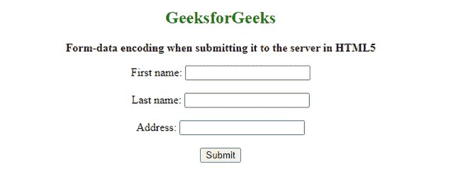

# 在 HTML5 中向服务器提交表单数据时，如何指定表单数据应该编码？

> 原文:[https://www . geeksforgeeks . org/如何在向 html5 中的服务器提交表单数据时对其进行编码/](https://www.geeksforgeeks.org/how-to-specify-the-form-data-should-be-encoded-when-submitting-it-to-the-server-in-html5/)

在本文中，我们将通过使用 HTML 文档中 [*<表单>*](https://www.geeksforgeeks.org/html-form-tag/) 元素中的 [**enctype**](https://www.geeksforgeeks.org/html-form-enctype-attribute/) 属性来指定表单数据在提交给服务器时应该编码。此属性指定在提交到服务器时应该以编码形式出现的数据。此属性用于保存来自第三方的敏感用户数据。

**语法:**

```html
<form enctype = "value">
```

**注意:**该属性只有在方法为**的情况下才能使用。**

**值:**它接受两个值

*   **application/x-www-form-URL encoded:**有默认值。它用于在发送到服务器之前转换所有字符。它将特殊字符编码为十六进制值。
*   **多部分/表单数据:**不编码任何纯文本和特殊字符，仅将空格转换为+符号。

**示例:**

## 超文本标记语言

```html
<!DOCTYPE html>
<html>
<body style="text-align:center">
    <h2 style="color:green">GeeksforGeeks</h2>
    <b>Form-data encoding when submitting it to the server in HTML5</b>

<p></p>

    <form action="#"
        method="post"
        enctype="multipart/form-data">
        First name:
        <input type="text"
            name="fname"><br/>
        <br> Last name:
        <input type="text"
            name="lname"><br/>
        <br>   Address:
        <input type="text"
            name="Address"><br/>
        <br>
        <input type="submit"
            value="Submit">
    </form>
</body>

</html>
```

**输出:**

