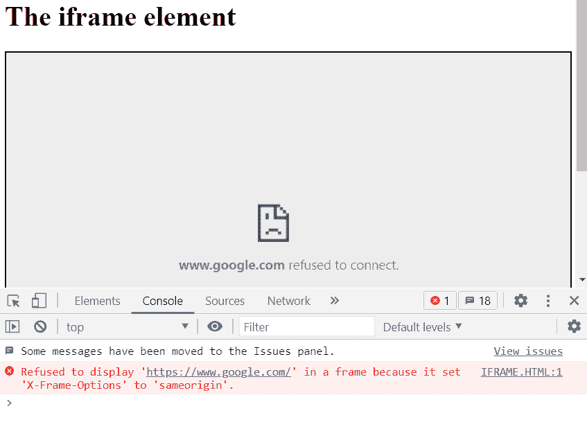

# 如何指定页面的 HTML 内容在 iframe 元素 HTML5 中显示？

> 原文:[https://www . geesforgeks . org/如何指定页面的 html 内容以在 iframe 元素中显示 html5/](https://www.geeksforgeeks.org/how-to-specify-the-html-content-of-the-page-to-show-in-the-iframe-element-html5/)

在这篇文章中，我们将学习如何在网页浏览器中使用带有 HTML 的 JavaScript 静态和动态地将网页内容指定到**<【iframe】>**。我们需要一个网页浏览器，即铬(推荐)或电子应用。本文将解释如何将任何外部网页分配或嵌入到另一个网页中，甚至使用 JavaScript 动态更改嵌入网页的内容。让我们开始吧！

**注:**有一些网站在**<【iframe】>**中无法显示，我们会在文章中进一步讨论。

**语法:**

```html
<iframe id="" src="" style=""></iframe>
```

< *iframe >* 对象的 *src* 成员持有嵌入网页的来源。我们可以静态地给它分配地址，并在运行时动态地改变它，如下所述:

**动态分配方法:**

*   从输入字段获取源。

    ```html
    let geeks = document.getElementById("<id name/class name>").value; 
    ```

*   将输入分配给 *iframe 的“ *src* ”成员。*

    ```html
    document.getElementById("<id name/class name>").src = geeks;
    ```

下面是说明使用 *iframe 的代码。*

**示例:**

## 超文本标记语言

```html
<!DOCTYPE html>
<html>

<body>
  <h1>The iframe element</h1>
  <iframe id="embed1" src=
"https://www.geeksforgeeks.org"
          style="border-style:1px;border-style: solid; 
                 width:100%; height:400px;
                 margin-bottom: 40px;">
  </iframe>

  <input type="text" id="source" style="width: 60%" 
    placeholder="Enter the link of source."/> 
  <button id="loadpage">Change Webpage</button> 

  <script>
    document.getElementById("loadpage").onclick = 
      function updatesource() { 
      let newsource = document.getElementById("source").value;          
      document.getElementById("embed1").src = newsource;
    }; 
  </script> 
</body>

</html>
```

**输出:**

*   加载页面后，默认页面如下所示

    

*   在输入栏中输入新的网页源并按下“更改网页”按钮后。

    

如果 *< iframe >* 不工作？
google.com、facebook.com、messenger.com 等网站由于一些相同的起源冲突，不支持 *iframe* 。
如果你试图加载那些不支持 *iframe* 的网站，你会在控制台中得到这个错误。



**注:**

1.  你需要在网址前加上“http://”或“https://”，否则会出错。
2.  记住那些不支持 *iframe* 的网站。