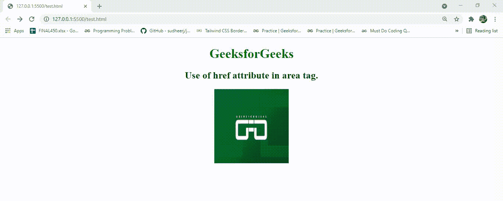

# 如何在 HTML5 中指定图片区域的超链接目标？

> 原文:[https://www . geesforgeks . org/如何指定 html5 中图像区域的超链接目标/](https://www.geeksforgeeks.org/how-to-specify-the-hyperlink-target-for-the-area-of-an-image-in-html5/)

**href** 属性用于指定 HTML5 中区域的超链接目标。区域标签本身不是超链接。<标签应该总是有一个开始标签和一个结束标签。[坐标属性](https://www.geeksforgeeks.org/html-area-coords-attribute/)在元素上已经过时。相反，始终使用图像地图的区域标签，其中坐标属性可以在区域标签中使用。形状属性也应如此。下面的例子说明得很清楚。

**语法:**

```html
<area href = "URL">
```

**示例:**

## 超文本标记语言

```html
<!DOCTYPE html>
<html>
  <body style="text-align: center">
    <h1 style="color: green">GeeksforGeeks</h1>
    <h2>Use of href attribute in area tag.</h2>

    

    <map name="gfg">
      <!-- You'll be able to go to the link only 
                when clicked on top-left corner -->
      <area
        shape="rect"
        coords="0, 0, 50, 50"
        alt="gfg"
        href="https://www.geeksforgeeks.org"
      />
    </map>
  </body>
</html>
```

**输出:**

