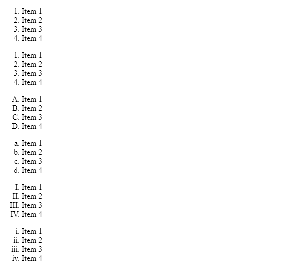
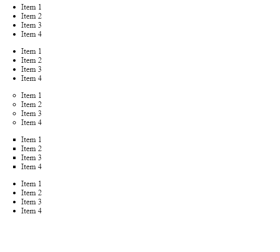

# 如何在 HTML5 中指定列表中要使用的标记种类？

> 原文:[https://www . geeksforgeeks . org/如何指定要在 html5 列表中使用的标记种类/](https://www.geeksforgeeks.org/how-to-specify-the-kind-of-marker-to-be-used-in-the-list-in-html5/)

HTML 中有两种类型的列表，第一种是使用

标签创建的有序列表，第二种是使用标签创建的无序列表。这两个列表都应该有一个标签来表示其中的数据。

有序列表以可计数的形式表示数据。这里的标记是数字。例如:

1.  项目 1
2.  项目 2
3.  项目 3

无序列表以不可数的形式表示数据。这里的标记是一个圆盘。例如:

*   项目 1
*   项目 2
*   项目 3

本文的目的是向您展示如何在不使用 CSS 的情况下更改标记。

**有序列表标记:**有序列表中有五种类型的标记，标记是使用类型属性指定的。

**语法:**

```html
<ol type="Enter type of list"></ol>
```

**列表项类型:** [HTML ol 类型属性。](https://www.geeksforgeeks.org/html-ol-type-attribute/)

<figure class="table">T28】类型=“A”T34】类型=“A”

| **Type** | **Description** |
| Type = "1" | The list is numbered **(default)** |
| The list is numbered in capital letters. |

</figure>

**例 1:** 我们来实现有序列表属性。

## 超文本标记语言

```html
<!DOCTYPE html>
<html>

<body>
  <ol>
    <li>Item 1</li>
    <li>Item 2</li>
    <li>Item 3</li>
    <li>Item 4</li>
  </ol>
  <ol type="1">
    <li>Item 1</li>
    <li>Item 2</li>
    <li>Item 3</li>
    <li>Item 4</li>
  </ol>
  <ol type="A">
    <li>Item 1</li>
    <li>Item 2</li>
    <li>Item 3</li>
    <li>Item 4</li>
  </ol>
  <ol type="a">
    <li>Item 1</li>
    <li>Item 2</li>
    <li>Item 3</li>
    <li>Item 4</li>
  </ol>
  <ol type="I">
    <li>Item 1</li>
    <li>Item 2</li>
    <li>Item 3</li>
    <li>Item 4</li>
  </ol>
  <ol type="i">
    <li>Item 1</li>
    <li>Item 2</li>
    <li>Item 3</li>
    <li>Item 4</li>
  </ol>
</body>

</html>
```

**输出:**



**无序列表标记:**无序列表中有三种类型的标记，标记是使用类型属性指定的。

**语法:**

```html
<ul type="Enter type of list"></ul>
```

**列表项类型:** [HTML ul 类型属性](https://www.geeksforgeeks.org/html-ul-type-attribute/) 。

<figure class="table">类型=【正方形】T36

| **Type** | **Description** |
| Type = [disc] | Used to display disc **(default)** |
| Type = [circle] | Used to display circles. |

</figure>

**示例 2:** 我们来实现无序列表属性。

## 超文本标记语言

```html
<!DOCTYPE html>
<html>

<body>
  <ul>
    <li>Item 1</li>
    <li>Item 2</li>
    <li>Item 3</li>
    <li>Item 4</li>
  </ul>
  <ul type="disc">
    <li>Item 1</li>
    <li>Item 2</li>
    <li>Item 3</li>
    <li>Item 4</li>
  </ul>
  <ul type="circle">
    <li>Item 1</li>
    <li>Item 2</li>
    <li>Item 3</li>
    <li>Item 4</li>
  </ul>
  <ul type="square">
    <li>Item 1</li>
    <li>Item 2</li>
    <li>Item 3</li>
    <li>Item 4</li>
  </ul>
  <ul type="triangle">
    <li>Item 1</li>
    <li>Item 2</li>
    <li>Item 3</li>
    <li>Item 4</li>
  </ul>
</body>

</html>
```

**输出:**



**注意:**这里的三角形类型不被浏览器支持，这就是为什么它显示的是圆盘而不是三角形。