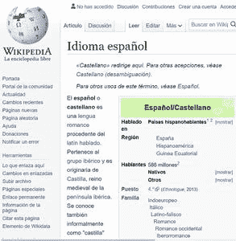

# 如何在 HTML5 中指定给定链接中文档的语言？

> 原文:[https://www . geesforgeks . org/如何指定给定链接中的文档语言 html5/](https://www.geeksforgeeks.org/how-to-specify-the-language-of-the-document-in-a-given-link-in-html5/)

在 HTML5 语言中给定链接中的文档由 [**hreflang 属性**](https://www.geeksforgeeks.org/html-a-hreflang-attribute/) 指定。这里传递的值(或*语言代码*)是网站语言的代码。(例如，如果给定链接中的文档/网站是英文的 *en* 作为值传递)。

以下是说明使用 *hreflang* 属性的示例。

**例 1:**

## 超文本标记语言

```html
<!DOCTYPE html>
<html>

<body>
  <h2>Welcome To GFG</h2>

<p>Click
    <a href=
"https://www.geeksforgeeks.org/"
       hreflang="en">
     here
    </a>to visit GeeksForGeeks website
  </p>

</body>

</html>
```

**输出:**点击上述链接后，将重定向至以下文档，该文档为*英语* :


**例 2:**

## 超文本标记语言

```html
<!DOCTYPE html>
<html>

<body>
  <h2>Welcome To GFG</h2>

<p>Click
      <a href=
"https://es.wikipedia.org/wiki/Idioma_espa%C3%B1ol"
         hreflang="es">
        here
      </a>
      to visit Wikipedia spanish website
    </p>

</body>

</html>
```

**输出:**点击上述链接后，将重定向至以下文件，该文件为*西班牙语*:

