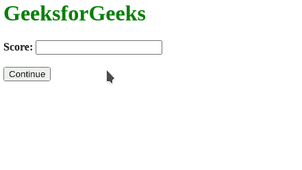

# 如何在 HTML5 中为一个输入字段指定合法的数字区间？

> 原文:[https://www . geesforgeks . org/如何指定 html5 中输入字段的合法数字间隔/](https://www.geeksforgeeks.org/how-to-specify-the-legal-number-intervals-for-an-input-field-in-html5/)

在本文中，我们学习如何在输入字段中设置合法的数字间隔。这有助于用户输入遵循给定间隔的数字，并且在验证期间不允许任何其他值。

我们必须使用<输入>元素的**步骤**属性来设置输入字段中的合法间隔。我们将首先创建一个包含输入区域的表单，并将其 step 属性设置为所需的值。当用户试图通过显示错误来提交表单时，字段的验证将自动进行。

**语法:**

```html
<input type="number" step="value">
```

**示例:**在本例中，步长属性设置为 4，因此允许用户输入步长为 4 的值。

## 超文本标记语言

```html
<html>
<body>
    <h1 style="color: green">
      GeeksforGeeks
    </h1>
    <form action="/">
        <label for="score">
          <b>Score:</b>
        </label>
        <input type="number" name="score"
               id="score" step="4">
        <br><br>
        <button type="submit">
          Continue
        </button>
    </form>
</body>
</html>
```

**输出:**

