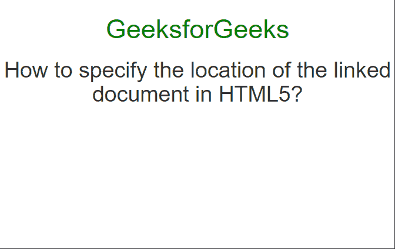
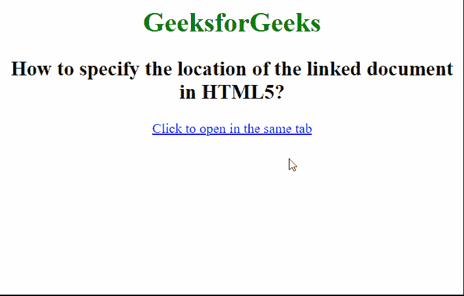

# 如何在 HTML5 中指定链接文档的位置？

> 原文:[https://www . geesforgeks . org/如何在 html5 中指定链接文档的位置/](https://www.geeksforgeeks.org/how-to-specify-the-location-of-the-linked-document-in-html5/)

在本文中，我们将学习如何在 HTML5 中指定链接文档的位置。这可以通过在<链接>元素中使用 **href** 属性来实现。这有各种用途。最常用于将样式表或图标链接到文档。

**语法:**

```html
<link rel="stylesheet" type="text/css" href="style.css">
```

下面的例子说明了 **href** 属性的使用。

**示例 1:** 在本例中，使用 href 属性指定了外部样式表的位置。

## 超文本标记语言

```html
<html>
<head>

  <!-- Bootstrap CSS from CDN -->
  <link rel="stylesheet"
        href=
"https://maxcdn.bootstrapcdn.com/bootstrap/3.3.7/css/bootstrap.min.css">

  <!-- Custom styling -->
  <style>
    h1 {
      color: green;
    }

    h1, h2 {
      text-align: center;
    }
  </style>
</head>
<body>
  <h1>GeeksforGeeks</h1>
  <h2>
    How to specify the location of the
    linked document in HTML5?
  </h2>
</body>
</html>
```

**输出:**



**示例 2:** 在本例中，< a >标记用于使用 href 属性链接文档。

## 超文本标记语言

```html
<html>
<head>
  <style>
    h1 {
      color: green;
    }

    body {
      text-align: center;
    }
  </style>
</head>
<body>
  <h1>GeeksforGeeks</h1>
  <h2>
    How to specify the location of
    the linked document in HTML5?
  </h2>
  <a href="https://ide.geeksforgeeks.org/">
    Click to open in the same tab
  </a>
</body>
</html>
```

**输出:**

