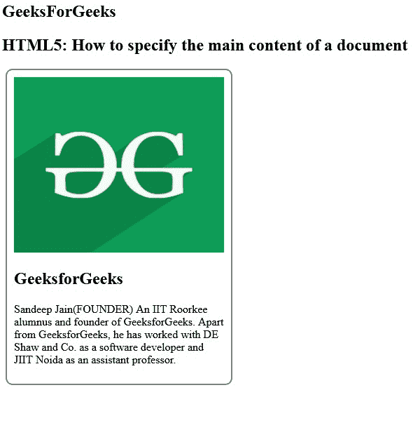
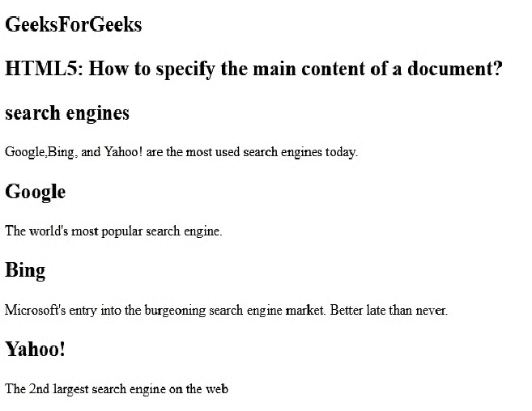

# 如何在 HTML5 中指定文档的主要内容？

> 原文:[https://www . geesforgeks . org/如何指定 html5 中文档的主要内容/](https://www.geeksforgeeks.org/how-to-specify-the-main-content-of-a-document-in-html5/)

**[<文章>标签](https://www.geeksforgeeks.org/html5-article-tag/)** 是 HTML5 中新增的切片元素之一。HTML 文章标签用于表示一篇文章。更具体地说， **<文章>标签**内的内容独立于网站的其他内容(即使可能相关)。

换句话说，article 元素表示由文档、页面或站点中的自包含组合组成的页面组件。

**例 1:**

```html
<!DOCTYPE html>
<html>

<head>
    <title>
        Specify the main content of a 
        document using HTML5
    </title>
</head>

<body>
    <h2>GeeksForGeeks</h2>

    <h2>
        HTML5: How to specify the 
        main content of a document
    </h2>

    <article style="width: 300px; 
                    border: 2px solid gray; 
                    padding: 10px; 
                    border-radius: 10px;
                    margin: 5px;">

        

        <h1>GeeksforGeeks</h1>

        <p>
            Sandeep Jain(FOUNDER) An IIT Roorkee 
            alumnus and founder of GeeksforGeeks.
            Apart from GeeksforGeeks, he has worked
            with DE Shaw and Co. as a software developer
            and JIIT Noida as an assistant professor.
        </p>
    </article>
</body>

</html>       
```

**输出:**


**例 2:**

```html
<!DOCTYPE html>
<html>

<head>
    <meta charset="utf-8" />

    <title>
        Specify the main content of 
        a document using HTML5
    </title>
</head>

<body>
    <h2>GeeksForGeeks</h2>
    <h2>
        HTML5: How to specify the 
        main content of a document?
    </h2>

    <article>
        <h1>search engines</h1>

        <p>
            Google, Bing, and Yahoo! are the 
            most used search engines today.
        </p>

        <h1>Google</h1>
        <p>
            The world's most popular 
            search engine.
        </p>

        <h1>Bing</h1>
        <p>
            Microsoft's entry into the 
            burgeoning search engine 
            market. Better late than 
            never.
        </p>

        <h1>Yahoo!</h1>
        <p>
            The 2nd largest search 
            engine on the web
        </p>
    </article>
</body>

</html>
```

**输出:**
