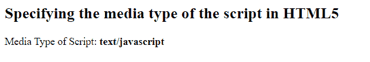

# 如何在 HTML5 中指定脚本的媒体类型？

> 原文:[https://www . geesforgeks . org/如何指定 html5 中的媒体类型脚本/](https://www.geeksforgeeks.org/how-to-specify-the-media-type-of-the-script-in-html5/)

[**HTML <脚本>类型**](https://www.geeksforgeeks.org/html-script-type-attribute/) 属性指定正在表示的脚本类型。类型属性标识出现在<脚本>和</脚本>标签之间的内容。它指定脚本的 MIME 类型，并标识标签的内容。它只有一个值，即媒体类型，用于指定脚本的 MIME 类型。它的默认值是“文本/javascript”。

**注意:** JavaScript 不再需要 HTML5 中的 type 属性。

**语法:**

```html
<script type="script_media_type">
```

该属性值将属于以下类别之一:

**示例:**

## 超文本标记语言

```html
<!DOCTYPE html>
<html>

<script type="text/javascript">
    let typeValue = document.querySelector('script[type]');
    let id = typeValue.getAttribute('type');
</script>

<body>

    <h2>
        Specifying the media type of the script in HTML5
    </h2>
    <p>Media Type of Script:
        <strong id="scriptType"></strong>
    </p>

    <script>
        document.getElementById("scriptType").innerHTML = id;
    </script>

</body>

</html>
```

**输出:**

