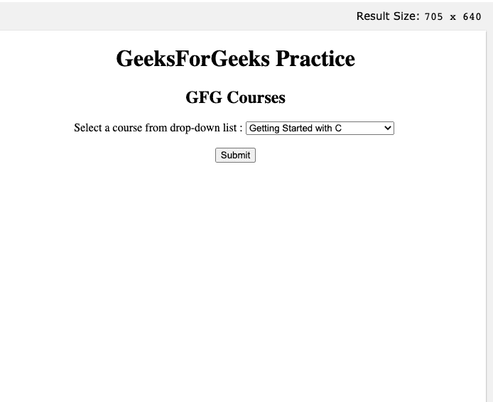
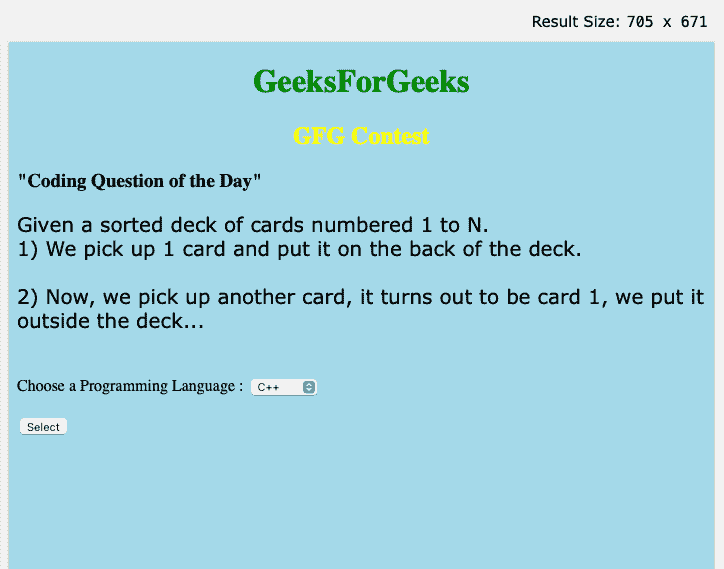

# 如何在 HTML5 中指定下拉列表的名称？

> 原文:[https://www . geesforgeks . org/如何指定下拉列表名称 html5/](https://www.geeksforgeeks.org/how-to-specify-the-name-for-drop-down-list-in-html5/)

下拉列表也是允许人们从众多选项中只选择一个选项的另一种方式。由于默认选项通常是列表中的第一项，如果您知道一个选项总是比其他选项更受欢迎，那么使用下拉列表可能是一个安全的选择。下拉列表只能在用户必须进行选择时使用，因为它没有为用户提供不选择某些内容的选项。在 HTML 5 中，名称属性定义了下拉列表的名称。输入表单后，JavaScript 中的 name 属性用于引用元素或表单数据。

**语法:**

```html
<select>
   <option value=””>option1</option>
   <option value=””>option2</option>
</select>
```

*<选择>* 是一个用于构建下拉列表的标签，如上面的代码所示。嵌入在选择标签中的 *<选项>* 标签是选择列表的一个属性值或多个属性，该值表示该选项是否被选择、禁用或具有某些其他属性。我们可以使用 CSS 来显示我们的选择列表效果，并像这样设置位置。

**属性:**以下是包含在 *<选择>* 标签中的一些属性

*   **名称:**该属性对于命名将发送到服务器进行检测并接收必要值的控件非常有用。
*   **多重:**如果属性设置为“多重”，用户将从选择器列表中选择几个值
*   **大小:**大小参数决定了覆盖下拉列表的滚动框的大小。它对于突出显示列表中的多个选项也很有用。
*   **值:**该属性表示是否选择了选择列表中的选项。
*   **选中:**选中的属性允许在页面加载开始时显示列表中已经选中的列表项。
*   **标签:**标签属性是标注选项值的另一种方法。
*   **Disabled:** 如果我们想要一个带有禁用选项的下拉列表，我们可以在 HTML 选择列表中使用 Disabled 属性。
*   **onChange** :当用户从下拉列表中选择一个选项时，项目选择会触发一个事件。
*   **onFocus:** 当用户将鼠标悬停在选择列表选项上进行选择时，会触发一个事件来选择对象。
*   **表单:**该属性用于指定一个或多个与选择字段相似的类型。
*   **disabled:** 在这个属性的支持下，我们会对用户隐藏我们的下拉列表。
*   **必选:**在填写表单时，我们要明确这个字段允许用户在提交表单之前从列表中选择一些值，所以在这种情况下，我们定义用户必须从列表中选择任何值。

**示例 1:** 下面是说明带有名称属性的下拉列表的代码。

## 超文本标记语言

```html
<!DOCTYPE html>
<html>

<body style="text-align:center;">
  <h1>GeeksForGeeks Practice</h1>
  <h2>GFG Courses</h2>

  <form action="/action_page.php">
    <label for="course">
      Select a course from drop-down list :
    </label>

    <select name="course" id="course">
      <option value="1">
        Getting Started with C
      </option>

      <option value="2">
        DSA Self-Paced
      </option>

      <option value="3">
        Complete Interview Preparation
      </option>

      <option value="4">
        Java Collections
      </option>

      <option value="5">
        30 Days Of Code
      </option>
    </select>
    <br><br>
    <input type="submit" value="Submit">
  </form>
</body>

</html>
```

**输出:**



输出

**例 2:**

## 超文本标记语言

```html
<!DOCTYPE html>
<html>

<head>
  <style>
      body{
        background-color: lightblue;}
      h1{
        color: green;
        text-align: center;
      }
      h2{
        color: yellow;
        text-align: center;
      }
      p{
        font-family: verdana;
        font-size: 20px;
      }
  </style>
</head>

<body>
  <h1>GeeksForGeeks</h1>
  <h2>GFG Contest</h2>
  <h3>"Coding Question of the Day"</h3>

<p>
    Given a sorted deck of cards numbered 1 to N.<br>
    1) We pick up 1 card and put 
       it on the back of the deck.<br><br>
    2) Now, we pick up another card, 
       it turns out the deck..<br><br>
  </p>

  <form action="/action_page.php">
    <label for="course">
      Choose a Programming Language :
    </label>
    <select name="course" id="course">
      <option value="1">C++</option>
      <option value="2">C</option>
      <option value="3">JAVA</option>
      <option value="4">Python</option>
      <option value="5">C#</option>
    </select><br><br>
    <input type="submit" value="Select">
  </form>
</body>

</html>
```

**输出:**

