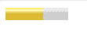
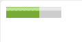

# 如何在 HTML5 中指定量表的最优值？

> 原文:[https://www . geesforgeks . org/如何为 html5 中的规格指定最佳值/](https://www.geeksforgeeks.org/how-to-specify-the-optimal-value-for-the-gauge-in-html5/)

任务是为仪表指定最佳值。最佳值用于指示仪表的仪表范围。该值必须在最小值和最大值之间的范围内。它用于在一个定义明确的范围内用摩擦值来定义刻度的测量。它也被称为标尺。

**进场:**

*   使用仪表标签在正文中添加仪表。
*   在仪表标签中设置最佳值。

**语法**

```html
<meter optimum = "value"></meter>  
```

**注:**包含代表仪表最佳值的浮点数。

**例 1:**

## 超文本标记语言

```html
<html>
   <body> 
      <meter value="0.6"
         max="1"
         min="0"
         optimum="0.5"
         high="0.5"
         low="0.2"> 
      </meter> 
   </body>
</html>
```

**输出**



**例 2:** 同上，只是改变最佳值

## 超文本标记语言

```html
<!DOCTYPE html> 
<html>
   <body> 
      <meter value="0.6"
         max="1"
         min="0"
         optimum="0.6"
         high="0.5"
         low="0.2"> 
      </meter> 
   </body>
</html>
```

**输出**

