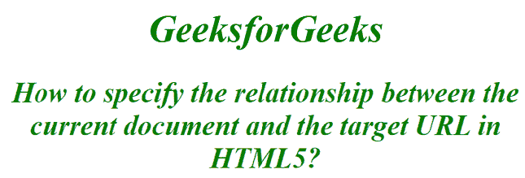

# 如何在 HTML5 中指定当前文档与目标 URL 的关系？

> 原文:[https://www . geesforgeks . org/如何指定当前文档和 html5 中的目标 url 之间的关系/](https://www.geeksforgeeks.org/how-to-specify-the-relationship-between-the-current-document-and-the-target-url-in-html5/)

我们通过在 HTML 中使用 [<链接>](https://www.geeksforgeeks.org/html-link-tag/) 标签来指定当前文档和目标 URL 之间的关系。链接标签用于定义文档和外部资源之间的链接。它仅在 href 属性存在时使用。

**进场:**

*   要指定当前和链接文档之间的关系，请使用 **[rel 属性](https://www.geeksforgeeks.org/html-rel-attribute/)**

**属性值:**

*   **替代:**指定文档的替代链接(即打印页面、翻译或镜像)。
*   **作者:**它定义链接的作者
*   **dns-预取:**它指定浏览器应该为目标资源的源抢先执行 DNS 解析
*   **帮助:**指定帮助文档的链接。示例:<链接 rel = " help " href = " help/">
*   **图标:**指定给定文档中的导入图标
*   **许可证:**它指定了文档版权信息的链接
*   **下一步:**提供下一个文档的串联链接
*   **平回:**指定平回发球的地址
*   **预连接:**它指定目标应该抢先连接到源资源
*   **预取:**指定缓存目标文档。
*   **预加载:**指定浏览器必须先取后缓存
*   **先决条件:**指定浏览器应该加载
*   **prev:** 指定选择中的上一个文档
*   **搜索:**指定文档的搜索工具。
*   **样式表:**它导入样式表

**语法:**

```html
 <link rel="stylesheet" type="text/css" href="styles.css">
```

**例 1:**

## 超文本标记语言

```html
<!DOCTYPE html>
<html>
<head>    

    <link rel="stylesheet"
        type="text/css"
        href="styles.css">
</head>

<body>

    <h1>GeeksforGeeks</h1>
    <h2>How to specify the relationship between the current document
       and the target URL in HTML5?</h2>
</body>

</html>
```

**CSS 代码:**以下是上述 HTML 代码中使用的代码“styles.css”的内容。

```html
h1 , h2 
{
   color:green;
   text-align: center;
   font-style: italic;
   font-weight: bold;
}
```

**输出:**



链接文档

**例 2:**

```html
<!DOCTYPE html> 
<html> 

<head> 
    <link rel="stylesheet"
        type="text/css"
        href="index_screen.css"> 

    <link rel="stylesheet"
        type="text/css"
        href="index_print.css"> 
</head> 

<body> 
    <center> 
        <h1>GeeksforGeeks</h1> 
        <p><a href="https://ide.geeksforgeeks.org/tryit.php"
        target="_blank"> 
    Click here 
    </a> 
    </center> 
</body> 

</html>                    
```

**输出:**
