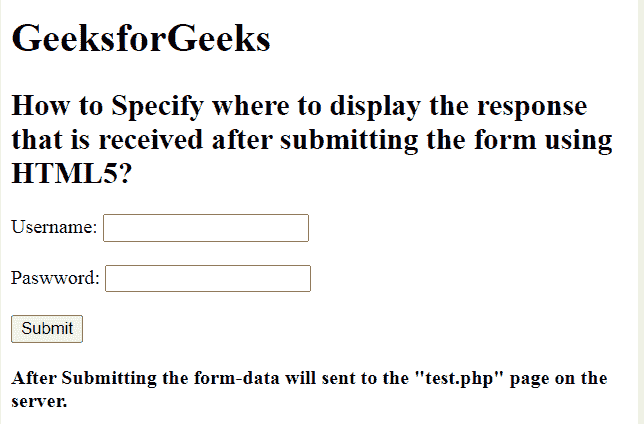

# 使用 HTML5 提交表单后如何指定响应页面？

> 原文:[https://www . geesforgeks . org/如何使用 html5 指定提交表单后的响应页面/](https://www.geeksforgeeks.org/how-to-specify-the-response-page-after-submitting-the-form-using-html5/)

在本文中，我们将使用文档中 **<表单>** 元素中的**动作**属性来指定提交表单后的响应页面。此属性用于指定提交表单后发送到服务器的表单数据的 URL 页面或目标。它可以用在“形式”元素中。

**语法:**

```html
<form action="URL">
```

**示例:**

```html
<!DOCTYPE html>
<html>

<head>
    <title>
        How to Specify where to display the
        response that is received after 
        submitting the form using HTML5?
    </title>
</head>

<body>
    <h1>GeeksforGeeks</h1>

    <h2>
        How to Specify where to display the
        response that is received after 
        submitting the form using HTML5?
    </h2>

    <form action="test.php" method="post" id="users">

        <label for="username">
            Username:
        </label>

        <input type="text" name="username" id="Username">

        <br>

        <label for="password">
            Password:
        </label>
        <input type="password" name="password">
    </form>
    <br>

    <button onclick="myGeeks()">
        Submit
    </button>
    <br><br>

    <b>
        After Submitting the form-data will sent
        to the "test.php" page on the server.
    </b>
</body>

</html>
```

**输出:**


**支持的浏览器如下:**

*   谷歌 Chrome
*   微软公司出品的 web 浏览器
*   火狐浏览器
*   歌剧
*   旅行队