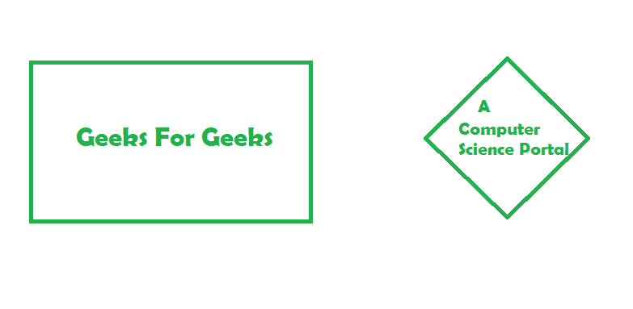
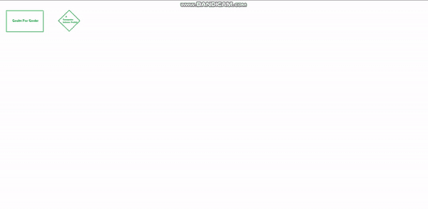
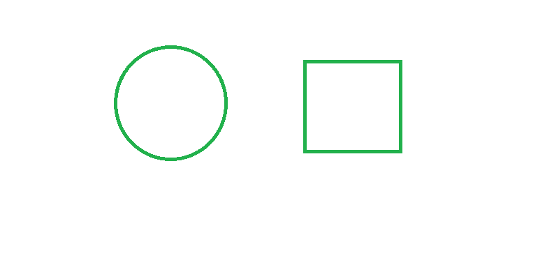
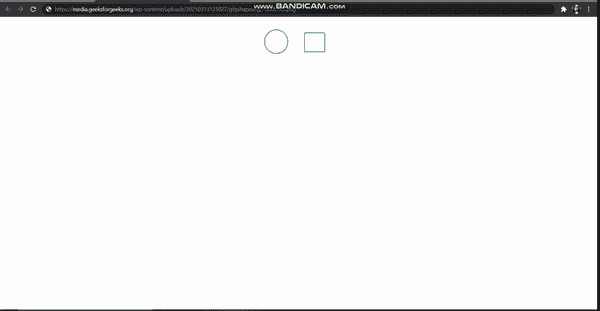

# 如何在 HTML5 中指定区域的形状？

> 原文:[https://www . geesforgeks . org/如何在 html5 中指定区域形状/](https://www.geeksforgeeks.org/how-to-specify-the-shape-of-the-area-in-html5/)

在本文中，我们将学习 HTML 区域标签的形状属性，以及如何在 HTML5 中使用它来指定区域的形状。

我们使用区域元素的**形状**属性来指定形状，并且可以与**坐标**属性配对来指定区域的形状、大小和位置。

**语法:**

```html
<area shape="default/rect/circle/poly" coords="coordinate1,
corordinate2..." href="link" alt="alternate text">
```

**形状属性值及其功能和坐标属性:**

*   **默认:**用于在 HTML 中指定一个区域的整个区域。
    坐标:它没有坐标，因为它横跨整个地区。
*   **矩形:**用于定义矩形区域。
    坐标:
    *   x <sub>1</sub> ，y <sub>1</sub> 为左上角。
    *   右下方为 x <sub>2</sub> ，y <sub>2</sub> 。
*   **圆形:**用于定义圆形区域。
    坐标:
    *   x，y 为圆心。
    *   半径为半径的半径。
*   **多边形:**用于定义多边形区域。
    坐标:
    *   **x <sub>1</sub> ，y <sub>1</sub> ，x <sub>2</sub> ，y <sub>2</sub> … x <sub>n</sub> ，y <sub>n</sub> 为多边形的边。**

**注意:**如果第一个和最后一个坐标对不同，最后一个坐标对将用于闭合多边形。

以上已经以表格形式总结如下:

<figure class="table">

| **<u>[functionality]</u>** | **<u>Attribute value</u>** | **<u>Coordinate</u>** |
| Specify the entire area. | default | (Define the whole area) |
| Define a rectangular area. | rectangle | **x <sub>1</sub> ，y <sub>1</sub> ，** **x <sub>2</sub> ，y<sub>2</sub>**–前 2 为左上角后 2 为右下角的矩形 |
| To define a circle. | circle | **x、y、rad**–前两个坐标的圆的中心和最后一个半径。 |
| Define a polygon area. | polygon | **x <sub>1</sub> ，y <sub>1</sub> ，x <sub>2</sub> ，y <sub>2</sub> ，…，x <sub>n</sub> ，y<sub>n</sub>**–多边形边的坐标。

如果第一个和最后一个坐标对不同，最后一个坐标对将用于闭合多边形。 |

</figure>

下面是几个例子来说明这个属性

**例 1:**

## index.html

```html
<!DOCTYPE html>
<html>
  <body>
    
    <map name="map-gfg">
      <area
        shape="rect"
        coords="15,32,145,104"
        href="https://www.geeksforgeeks.org/"
        alt="GFG home page"
        target="_blank"/>

      <area
        shape="poly"
        coords="242,28.5,279.5,63.5,242,104,200,63.5"
        href=
"https://practice.geeksforgeeks.org/courses/dsa-self-paced?gclid=
Cj0KCQiA7YyCBhD_ARIsALkj54qc8HT6TPpLZAcGs-r2DF38ZnTHpNJ1cVIw1PqHj4e15x-34tSr6oYaAjwUEALw_wcB"
        alt="GFG data-structures course"
        target="_blank"
      />
    </map>
  </body>
</html>
```

**输出:**这里，图片的矩形部分链接到极客官方页面 GeeksForGeeks，多边形部分映射到极客为极客准备的 DSA 课程。单击其中任何一个都会将用户导向与该形状相关联的特定链接。我们根据自己选择的图像设置特定形状的坐标。



这里有一个简短的 gif 来演示上面例子的功能。



**例 2 :**

## index2.html

```html
<!DOCTYPE html>
<html>
  <body>
    <center>
      
    </center>

    <map name="map-gfg">
      <area
        shape="circle"
        coords="91,56,30"
        href=
"https://media.geeksforgeeks.org/wp-content/uploads/20210313125218/circle-300x145.png"
        alt="Filled Circle"
        target="_blank"/>

      <area
        shape="rect"
        coords="166,32,218,84"
        href=
"https://media.geeksforgeeks.org/wp-content/uploads/20210313125412/sq-300x145.png"
        alt="filled square"
        target="_blank"/>
    </map>
  </body>
</html>
```

**输出:**在这里，我们有一个圆和一个正方形(即使对于这个，我们也使用 rect 作为属性值)。

 