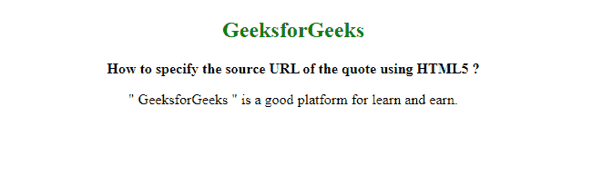

# 如何用 HTML5 指定报价的来源 URL？

> 原文:[https://www . geesforgeks . org/如何使用 html5 指定报价的来源 URL/](https://www.geeksforgeeks.org/how-to-specify-the-source-url-of-the-quote-using-html5/)

在本文中，我们将学习如何使用 HTML 指定引号的源 URL。我们执行这个任务只是通过使用文档中< q >元素的 [**引用**](https://www.geeksforgeeks.org/html-q-cite-attribute/) 属性。此属性包含表示引号 URL 的字符串值。

**语法:**

```html
<q cite="URL">
```

**示例:**下面的代码说明了 *< q >* 标签中*引用*属性的用法。

## 超文本标记语言

```html
<!DOCTYPE html>
<html>
  <head>
    <style>
      h1,
      h2 {
        color: green;
        font-weight: bold;
      }
    </style>
  </head>

  <body style="text-align: center">
    <h2>GeeksforGeeks</h2>

    <b> How to specify the source URL of the quote using HTML5 ? </b>

    <p>
      <q cite="https://www.geeksforgeeks.org"> GeeksforGeeks </q>
      is a good platform for learn and earn.
    </p>
  </body>
</html>
```

**输出:**

