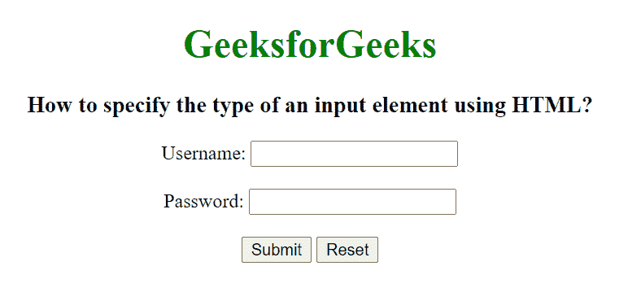

# 如何用 HTML 指定输入元素的类型？

> 原文:[https://www . geesforgeks . org/如何使用 html 指定输入元素的类型/](https://www.geeksforgeeks.org/how-to-specify-the-type-of-an-input-element-using-html/)

在本文中，我们将使用 HTML 指定输入元素的类型。HTML <input>类型属性用于指定要显示的<input>元素的类型。<input>类型属性的默认类型是文本。

**语法:**

```html
<input type="value">
```

**属性值:**

*   **按钮:**用于定义文档中可点击的按钮。它主要与 JavaScript 一起使用来激活脚本。
*   **复选框:**用于定义复选框字段。该复选框显示为一个方形框，当它被激活时会被勾选。它允许用户在所有有限的选项中选择一个或多个选项。
*   **颜色:**用于定义拾色器。该值应该是七个字符的十六进制表示法。它的默认值是#000000(黑色)。
*   **日期:**用于定义日期选择器或控制字段。该值将是年、月和日。
*   **邮箱:**用于定义邮箱地址的字段。自动验证输入的电子邮件 id，以检查电子邮件 id 的格式是否正确。
*   **文件:**用于指定文件选择字段，并添加按钮选择要上传到表单的文件。
*   **隐藏:**用于定义输入隐藏字段。隐藏字段还包括用户在提交表单时无法看到或修改的数据。隐藏字段仅存储提交表单时需要更新的数据库记录。
*   **图像:**用于定义图像为提交按钮。
*   **月:**用于指定年月字段的控制。该值的格式必须为“YYYY-MM”。
*   **数字:**用于指定输入数字的输入字段。
*   **密码:**用于指定输入标签的密码字段。密码应通过 HTTPS 页面提供，因为它包含用户的敏感信息。
*   **单选:**用于定义单选按钮。单选按钮用于让用户从预定义选项列表中选择一个选项。单选按钮输入控件是通过使用“input”元素创建的，该元素的类型属性的值为“Radio”。
*   **范围:**用于定义对用户输入的数字的控制。它可以对用户将要输入的不重要的数字或值设置限制。它的默认值范围从 0 到 100。
*   **复位:**用于定义复位按钮。重置按钮用于将所有表单值重置为其初始值。
*   **搜索:**用于定义输入搜索字符串的文本字段。
*   **提交:**用于定义提交按钮。它用于将所有用户值提交给表单处理程序。表单处理程序是一个服务器页面，它激活一个脚本来处理所有的输入值。
*   **电话:**用于定义输入用户电话号码的字段。
*   **文本:**用于定义单行文本字段。文本字段的默认宽度为 20 个字符。
*   **时间:**用于指定进入时间控制字段。
*   **网址:**用于定义输入网址的字段。在提交表单之前，会自动验证该输入值。
*   **周:**用于定义一周和一年控制字段。

**示例:**

## 超文本标记语言

```html
<!DOCTYPE html>
<html>

<head>
    <title>
        How to specify the type of
        an input element using HTML?
    </title>
</head>

<body style="text-align:center;">

    <h1 style="color:green;">GeeksforGeeks</h1>

    <h3>
        How to specify the type of an
        input element using HTML?
    </h3>

    <form action="#" method="get">
        Username: <input type="text" name="uname">

        <br><br>

        Password: <input type="password" name="pwd">

        <br><br>

        <button type="submit" value="submit">
            Submit
        </button>

        <button type="reset" value="reset">
            Reset
        </button>
    </form>
</body>

</html>
```

**输出:**

