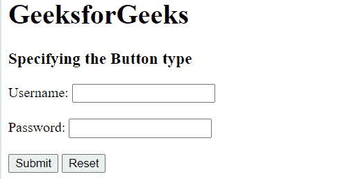

# 如何用 HTML5 指定按钮的类型？

> 原文:[https://www . geesforgeks . org/如何使用 html5-2 指定按钮类型/](https://www.geeksforgeeks.org/how-to-specify-the-type-of-button-using-html5-2/)

要在 HTML5 中指定按钮类型，我们可以使用 [HTML | <按钮>类型属性](https://www.geeksforgeeks.org/html-button-type-attribute/)。该属性用于指定按钮的类型。它指定了 *<按钮>* 元素的*类型*属性。 *<按钮>* 元素的默认类型因浏览器而异。

**语法:**

```html
<button type="button|submit|reset">
```

**示例:**

## 超文本标记语言

```html
<!DOCTYPE html> 
<html> 
    <head> 
        <title> 
            HTML button type Attribute 
        </title> 
    </head> 

    <body> 
        <h1>GeeksforGeeks</h1> 

        <h3>Specifying the Button type</h3> 

        <form action="#" method="get"> 
            Username: <input type="text" name="uname"> 

            <br><br> 

            Password: <input type="password" name="pwd"> 

            <br><br> 

            <button type="submit" value="submit"> 
                Submit 
            </button> 

            <button type="reset" value="reset"> 
                Reset 
            </button> 
        </form> 
    </body> 
</html>                                             
```

**输出:**



按钮类型