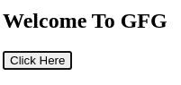
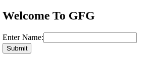
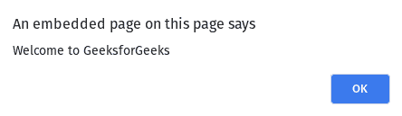
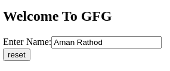
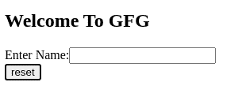

# 如何用 HTML5 指定按钮的类型？

> 原文:[https://www . geesforgeks . org/如何使用 html5 指定按钮类型/](https://www.geeksforgeeks.org/how-to-specify-the-type-of-button-using-html5/)

在本文中，我们将看到如何使用 HTML 设置按钮类型。HTML 中的 [<按钮>标签](https://www.geeksforgeeks.org/html-button-tag/)用于在网页上的表单内创建一个可点击的按钮。 **[按钮类型属性](https://www.geeksforgeeks.org/html-button-type-attribute/)** 指定按钮的类型(您应该始终声明按钮的类型)。

**<按钮>** 标签定义了一个可点击的按钮，用于提交表单或文档中的任何地方，以获得可访问的标准按钮功能。

**语法:**

```html
<button type=" ">
```

**示例 1:** 本示例使用 type 作为按钮创建一个简单的按钮。

## 超文本标记语言

```html
<!DOCTYPE html>
<html>

<body>
    <h2>Welcome To GFG</h2>
    <button name="button" type="button">
         Click Here
    </button>
</body>

</html>
```

**输出:**



**示例 2:** 本示例在单击按钮时创建提交表单。

## 超文本标记语言

```html
<!DOCTYPE html>
<html>

<body>
    <h2>Welcome To GFG</h2>
    <form> Enter Name:
        <input type="text" name="name" />
        <br/>
        <button type="submit" onclick=
            "alert('Welcome to GeeksforGeeks')">
           Submit
        </button>
    </form>
</body>

</html>
```

**输出:**

*   **点击按钮前:**
    
*   **点击按钮后:**
    

**示例 3:** 本示例创建一个重置表单按钮。

## 超文本标记语言

```html
<!DOCTYPE html>
<html>

<body>
    <h2>Welcome To GFG</h2>
    <form> Enter Name:
        <input type="text" name="name" />
        <br/>
        <button type="reset">Reset</button>
    </form>
</body>

</html>
```

**输出:**

*   **点击按钮前:**
    
*   **点击按钮后:**
    