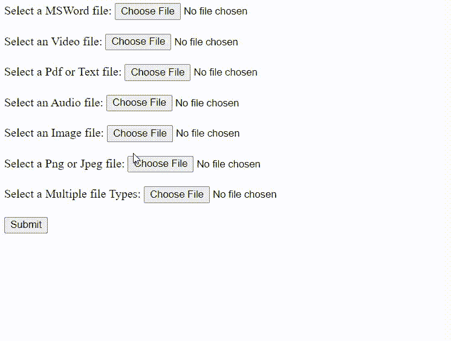

# 如何在 HTML5 中指定服务器接受的文件类型？

> 原文:[https://www . geesforgeks . org/如何指定服务器在 html5 中接受的文件类型/](https://www.geeksforgeeks.org/how-to-specify-the-type-of-files-that-server-accepts-in-html5/)

在本文中，我们将学习如何指定服务器在 HTML5 中接受的文件类型。 [<输入>接受属性](https://www.geeksforgeeks.org/html-input-accept-attribute/)用于指定服务器接受的文件类型。该属性只能用于<输入类型=“文件”>元素。此属性不用于验证工具，因为文件上载应该在服务器上进行验证。

我们将逐一添加每个特定的文件。

*   首先，我们将从使用 MSOffice 文件开始。我们将使用“接受”属性来指定文件类型。

    ```html
    <input type="File" name="" accept=".doc, .docx">
    ```

*   要指定视频文件，我们将使用以下代码。

    ```html
    <input type="File" name="" accept="video/*">
    ```

    **注:** The *为外卡，表示接受所有视频格式。

*   要指定文本或 PDF 文件，我们使用以下代码。

    ```html
    <input type="File" name="" accept=".pdf, .txt">
    ```

*   要指定音频文件，我们将使用以下代码。

    ```html
    <input type="File" name="" accept="audio/*">
    ```

*   要指定图像文件，我们将使用以下代码。

    ```html
    <input type="File" name="" accept="image/*">
    ```

*   要指定特定的 png 或 jpeg 文件，我们将使用以下代码。

    ```html
    <input type="File" name="" accept=".png, .jpg, .jpeg">
    ```

*   我们可以组合多种文件类型。如果我们想要所有的音频和视频格式和图像和 Pdfs 的 png 格式。

    ```html
    <input type="File" name="" 
        accept="video/*, audio/*, .png, .pdf">
    ```

**最终代码:**

## 超文本标记语言

```html
<!DOCTYPE html>
<html>

<body>
    <form>
        <label>Select a MSWord file:</label>
        <input type="File" name="" 
            accept=".doc, .docx"><br><br>

        <label>Select an Video file:</label>
        <input type="File" name="" 
            accept="video/*"><br><br>

        <label>Select a Pdf or Text file:</label>
        <input type="File" name="" 
            accept=".pdf, .txt"><br><br>

        <label>Select an Audio file:</label>
        <input type="File" name="" 
            accept="audio/*"><br><br>

        <label>Select an Image file:</label>
        <input type="File" name="" 
            accept="image/*"><br><br>

        <label>Select a Png or Jpeg file:</label>
        <input type="File" name="" 
            accept=".png, .jpg, .jpeg"><br><br>

        <label>Select a Multiple file Types:</label>
        <input type="File" name="" 
            accept="video/*, audio/*, .png, .pdf">
        <br><br>

        <input type="Submit" name="">
    </form>
</body>

</html>
```

**Output:**
