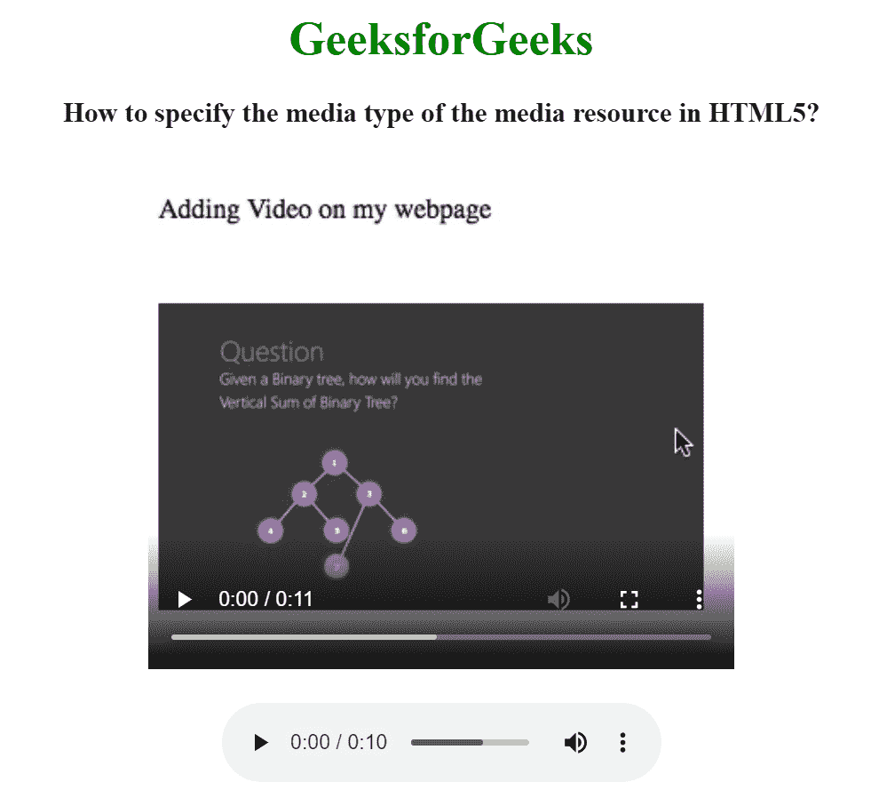

# 如何在 HTML5 中指定媒体资源的类型？

> 原文:[https://www . geesforgeks . org/如何指定 html5 中的媒体资源类型/](https://www.geeksforgeeks.org/how-to-specify-the-type-of-the-media-resource-in-html5/)

在这里，我们将看到如何使用 HTML 设置媒体资源的媒体类型。要设置媒体资源的媒体类型，我们使用<source>标记。此标签用于在网页或网站中附加多媒体文件，如音频、视频和图片。

<audio>、<video>和<picture>元素包含 [<源>](https://www.geeksforgeeks.org/html-source-tag/) 元素。</picture></video></audio>

**语法:**

```html
<source src="" type="">
   // Statements
</source>
```

**示例:**

## 超文本标记语言

```html
<!DOCTYPE html>
<html>

<head>
    <title>
        How to specify the media type
        of the media resource in HTML5?
    </title>
</head>

<body style="text-align: center;">
    <h1 style="color:green;">
        GeeksforGeeks
    </h1>

    <h3>
        How to specify the media type
        of the media resource in HTML5?
    </h3>

    <video width="400" height="350" controls>
        <source src=
"https://media.geeksforgeeks.org/wp-content/uploads/output-1.mp4"
        type="video/mp4">
    </video>
    </br></br>

    <audio controls>
        <source src=
"https://media.geeksforgeeks.org/wp-content/uploads/20190625153922/frog.mp3"
        type="audio/mp3">
    </audio>
</body>

</html>
```

**输出:**

