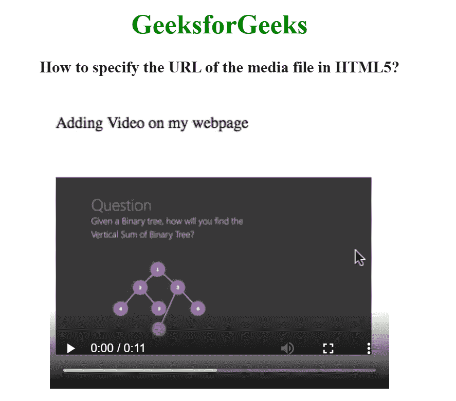

# 如何在 HTML5 中指定媒体文件的 URL？

> 原文:[https://www . geesforgeks . org/如何指定 html5 中媒体文件的 URL/](https://www.geeksforgeeks.org/how-to-specify-the-url-of-the-media-file-in-html5/)

这里我们将看到如何使用 HTML 设置媒体文件的 URL。要设置媒体文件的网址，我们使用<source>标签。该标签用于附加多媒体文件，如音频、视频和图片。

<audio>、<video>、<picture>元素包含 [<源>元素](https://www.geeksforgeeks.org/html-source-tag/)。</picture></video></audio>

**语法:**

```html
<source src="" type="">
   // Statements
</source>
```

**示例:**

## 超文本标记语言

```html
<!DOCTYPE html>
<html>

<head>
    <title>
        How to specify the URL of
        the media file in HTML5?
    </title>
</head>

<body style="text-align: center;">
    <h1 style="color:green;">
        GeeksforGeeks
    </h1>

    <h3>
        How to specify the URL of
        the media file in HTML5?
    </h3>

    <video width="400" height="350" controls>
        <source src=
"https://media.geeksforgeeks.org/wp-content/uploads/output-1.mp4"
            type="video/mp4">
    </video>
</body>

</html>
```

**输出:**



**支持的浏览器:**

*   谷歌 Chrome 4.0
*   Internet Explorer 9.0
*   Firefox 3.5
*   Safari 4.0
*   歌剧 10.5