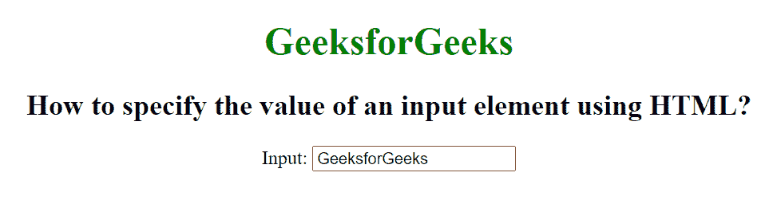
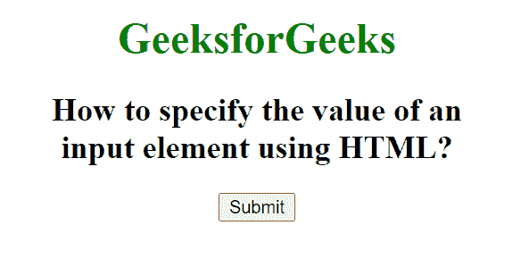

# 如何用 HTML 指定输入元素的值？

> 原文:[https://www . geesforgeks . org/如何使用 html 指定输入元素的值/](https://www.geeksforgeeks.org/how-to-specify-the-value-of-an-input-element-using-html/)

在本文中，我们将使用 HTML 设置输入元素的值。HTML 中<input>元素的值属性用于指定输入元素的初始值。它对于不同的输入类型有不同的含义:

*   “按钮”、“重置”和“提交”属性指定按钮上的文本。
*   “文本”、“密码”和“隐藏”属性指定输入字段的初始值。
*   “复选框”、“单选”和“图像”属性指定与输入相关联的值。

**语法:**

```html
<input value = "value">
```

**属性值:**包含指定输入元素值的单值文本。

**例 1:**

## 超文本标记语言

```html
<!DOCTYPE html>
<html>

<head>
    <title>
        How to specify the value of an
        input element using HTML?
    </title>
</head>

<body style="text-align:center">

    <h1 style="color:green;">
        GeeksforGeeks
    </h1>

    <h2>
        How to specify the value of an
        input element using HTML?
    </h2>

    Input Value: <input type="text" 
        value="GeeksforGeeks">
</body>

</html>
```

**输出:**



**例 2:**

## 超文本标记语言

```html
<!DOCTYPE html>
<html>

<head>
    <title>
        How to specify the value of an
        input element using HTML?
    </title>
</head>

<body style="text-align:center">

    <h1 style="color:green;">
        GeeksforGeeks
    </h1>

    <h2>
        How to specify the value of an
        input element using HTML?
    </h2>

    <input type="button" value="Submit">
</body>

</html>
```

**输出:**

