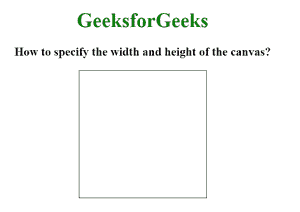
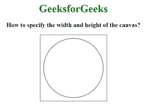

# 如何用 HTML 指定画布的宽度和高度？

> 原文:[https://www . geesforgeks . org/如何使用 html 指定画布的宽度和高度/](https://www.geeksforgeeks.org/how-to-specify-the-width-and-height-of-the-canvas-using-html/)

HTML 中的

<canvas>标记用于使用 JavaScript 在网页上绘制图形。它可以用来绘制路径、方框、文本、渐变和添加图像。默认情况下，它不包含边框和文本。</canvas>

**语法:**

```html
<canvas id="canvasID"> HTML Contents... <canvas>

```

**属性:**画布标签有两个属性，如下所示。

*   **高度:**该属性用于设置画布的高度。
*   **宽度:**该属性用于设置画布的宽度。

**例 1:**

## 超文本标记语言

```html
<!-- HTML code to illustrate height and
     width attribute of canvas tag -->
<!DOCTYPE html>
<html>

<body style="text-align:center;">
    <h1 style="color:green;">
        GeeksforGeeks
    </h1>
    <h3>
        How to specify the width
        and height of the canvas?
    </h3>

    <canvas id="canvasID" height="200" width="200" 
        style="border:1px solid black">
    </canvas>
</body>
</html>
```

**输出:**



**例 2:**

## 超文本标记语言

```html
<!-- HTML code to illustrate height and
    width attribute of canvas tag -->
<!DOCTYPE html>
<html>

<body style="text-align:center;">
    <h1 style="color:green;">
        GeeksforGeeks
    </h1>
    <h3>
        How to specify the width
        and height of the canvas?
    </h3>

    <canvas id="canvasID" height="200" width="200" 
        style="border:1px solid black">
    </canvas>

    <script>
        var canvas = document.getElementById("canvasID");
        // Getting a drawing context in the canvas
        var context = canvas.getContext("2d");
        context.beginPath();
        context.arc(100, 100, 90, 0, 2 * Math.PI);
        context.stroke(); 
    </script>
</body>

</html>
```

**输出:**

