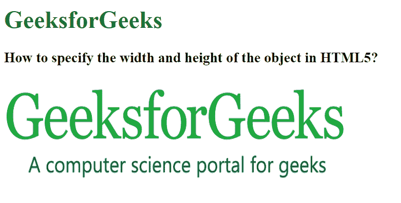

# 如何在 HTML5 中指定对象的宽度和高度？

> 原文:[https://www . geesforgeks . org/如何指定 html5 中对象的宽度和高度/](https://www.geeksforgeeks.org/how-to-specify-the-width-and-height-of-the-object-in-html5/)

<object>标签用于在网页中显示音频、视频、图像、pdf 和 Flash 等多媒体。它还可以用于在 HTML 页面中显示另一个网页。</object>

<param>标签也与该标签一起用于定义各种参数。在<object>和</object>标签中写入的任何文本都被视为浏览器不支持指定数据时出现的替代文本。这个标签支持 HTML 的所有全局和事件属性。

在本文中，我们将看到如何使用 HTML object [宽度](https://www.geeksforgeeks.org/html-object-width-attribute/)[高度](https://www.geeksforgeeks.org/html-object-height-attribute/)属性设置对象的宽度和高度。

**语法:**

```html
<object width="value" height="value" >  
   Object value 
</object>
```

**属性:**

*   **宽度:**指定对象的宽度。
*   **高度:**指定物体的高度。

**示例:**

## 超文本标记语言

```html
<!DOCTYPE html>
<html>

<head>
    <title>
        How to specify the width and
        height of the object in HTML5?
    </title>
</head>

<body>
    <h1 style="color: green;">
        GeeksforGeeks
    </h1>

    <h3>
        How to specify the width and
        height of the object in HTML5?
    </h3>

    <object data=
"https://media.geeksforgeeks.org/wp-content/cdn-uploads/Geek_logi_-low_res.png"
        width="450px" height="150px">
        GeeksforGeeks
    </object>
</body>

</html>
```

**输出:**

