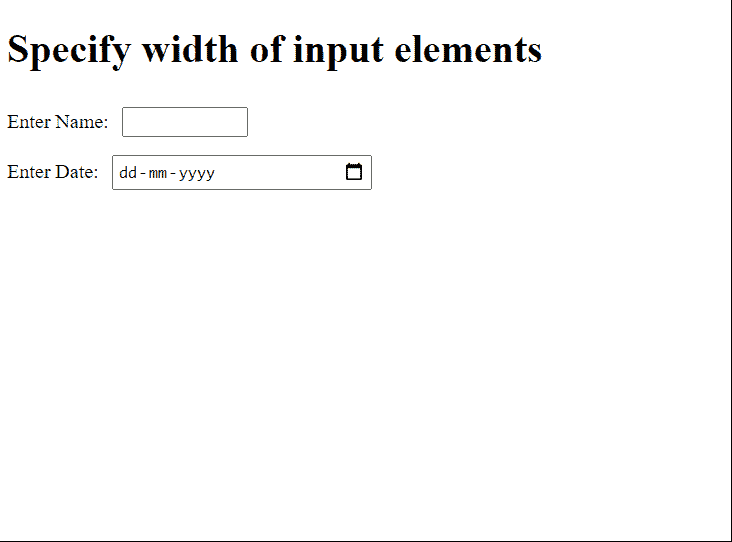

# 如何在 HTML5 中指定输入元素的宽度？

> 原文:[https://www . geesforgeks . org/如何指定 html5 中输入元素的宽度/](https://www.geeksforgeeks.org/how-to-specify-the-width-of-an-input-element-in-html5/)

在本文中，我们将指定输入元素的宽度。这可以通过使用**大小**属性或**宽度**属性来设置元素的宽度来完成。

大小属性与以下[输入类型](https://www.geeksforgeeks.org/html-input-type-attribute/)一起工作:文本、搜索、电话、网址、电子邮件和密码，而不是日期、图像、时间。对于这些，我们可以使用宽度属性。

创建一个 div，我们在其中输入信息。我们将输入 2 个名字和日期。对于输入名称，我们将使用输入类型-名称和大小属性。为了输入日期，我们将使用输入类型-日期和宽度属性(大小属性不适用于日期类型)。

**语法:**为大小属性。

```html
<input type="text" id="name" size=5>
```

**语法:**为 CSS 宽度。

```html
<input type="text" id="name" style="width: 200px;">
```

**示例:**这里我们使用了两个输入类型不同的输入，即姓名和日期。名称使用大小属性，日期使用日期属性这两个输入都是使用< br >来分隔的，并且在标题属性中使用基本样式。

## 超文本标记语言

```html
<!DOCTYPE html> 
<html lang="en"> 
<head>
    <style type="text/css">

        label {
          font: 18px;
        }

        input {
          margin: 7px;
          padding: 2px
        }
    </style>
</head>
<body> 
    <h1>Specify width of input elements</h1> 
    <div> 

        <label for="name">Enter Name:</label>
        <input type="text" id="name" size=10>
        <br>
        <label for="name">Enter Date:</label>
        <input type="date" id="last name" 
               style="width: 200px;">

    </div> 
</body> 

</html>
```

**输出:**

