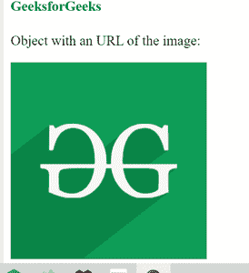

# 如何在 HTML5 中指定对象要使用的资源的 URL？

> 原文:[https://www . geesforgeks . org/如何指定 html5 中对象要使用的资源的 URL/](https://www.geeksforgeeks.org/how-to-specify-url-of-resource-to-be-used-by-the-object-in-html5/)

在本文中，我们将介绍如何在 HTML5 中指定对象要使用的资源的 URL。它可用于需要外部来源内容的页面。

可以通过在 [**<对象>**](https://www.geeksforgeeks.org/html-object-tag/) 标签中将数据属性设置为指定的 URL 来完成。

**语法:**

```html
<object data="URL">
```

**可能值**

*   **绝对 URL** :指向另一个网站。
*   **相对 URL** :指向网站内的一个文件。

**示例:**

## 超文本标记语言

```html
<!DOCTYPE html>
<html>

<body>
    <h4 style="color: green;">
        GeeksforGeeks
    </h4>

    <p>Object with an URL of the image:</p>

    <object data=
"https://media.geeksforgeeks.org/wp-content/uploads/20200327230544/g4gicon.png">
    </object>
</body>

</html>
```

**输出:**

