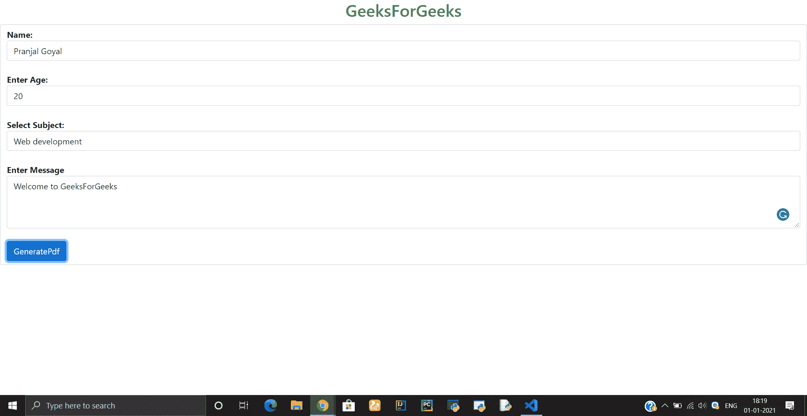

# 如何将 HTML 表单数据作为文本发送到 html2pdf？

> 原文:[https://www . geeksforgeeks . org/how-take-html-form-data-as-text-send-to-html 2pdf/](https://www.geeksforgeeks.org/how-to-take-html-form-data-as-text-and-send-them-to-html2pdf/)

为了将 HTML 表单数据转换为 pdf，主要的方法是使用 html2pdf 库中的 **html2pdf()函数**。

**方法:**首先，创建一个以加密类型为文本的表单，并添加一些输入字段。之后我们需要使用 html2pdf 库中的 html2pdf(element)函数。在表单的提交按钮上提供 **onclick()** 功能。 **html2pdf** (元素)函数接受一个输入，该输入是需要转换为 pdf 格式的标签或表单的 id。

**示例:**

## 超文本标记语言

```html
<!DOCTYPE html>
<html lang="en">
<head>
    <meta charset="UTF-8">
    <meta name="viewport" content=
     "width=device-width,initial-scale=1.0">

    <!-- CSS only -->
    <link href=
"https://cdn.jsdelivr.net/npm/bootstrap@5.0.0-beta1/dist/css/bootstrap.min.css"
        integrity=
"sha384-giJF6kkoqNQ00vy+HMDP7azOuL0xtbfIcaT9wjKHr8RbDVddVHyTfAAsrekwKmP1" 
        crossorigin="anonymous" rel="stylesheet">

    <!-- Html2Pdf  -->
    <script src=
"https://cdnjs.cloudflare.com/ajax/libs/html2pdf.js/0.8.1/html2pdf.bundle.min.js" 
        integrity=
"sha512vDKWohFHe2vkVWXHp3tKvIxxXg0pJxeid5eo+UjdjME3DBFBn2F8yWOE0XmiFcFbXxrEOR1JriWEno5Ckpn15A==" 
        crossorigin="anonymous">
    </script>

    <style>
        .heading{
          text-align: center;
          color: #2F8D46;
        }
    </style>
</head>

<body>
    <h2 class="heading">
      GeeksForGeeks
    </h2>

    <!-- Form encrypted as text -->
    <form id ="form-print" enctype="text/plain" 
          class="form-control">

        <label for="name">
          <strong>Name: </strong>
        </label>
        <input class="form-control" type="text" 
          id="name" name="Name" placeholder="Enter Name">
        <br>

        <label for="age">
          <strong>Enter Age: </strong>
        </label>
        <input class="form-control" type="text" 
          id="age" name="Age" placeholder="Enter Age">
        <br>

        <label for="subject">
          <strong>Select Subject: </strong>
        </label>
        <select class="form-control" 
            id="subject" name="subject">
            <option value="Web">
                Web development
            </option>
            <option value="App">
                App development
            </option>
            <option value="Others">
                Others
            </option>
        </select>
        <br>

        <label for="message">
          <strong>Enter Message </strong>
        </label>
        <textarea class= "form-control"
          id="message" name="message" 
          placeholder="Enter you message" 
          style="height:100px">
        </textarea>
        <br>

        <input type="button" class="btn btn-primary" 
          onclick="GeneratePdf();" value="GeneratePdf">
    </form>

    <script>          
        // Function to GeneratePdf
        function GeneratePdf() {
            var element = document.getElementById('form-print');
            html2pdf(element);
        }
    </script>

    <script src=
"https://cdn.jsdelivr.net/npm/bootstrap@5.0.0-beta1/dist/js/bootstrap.bundle.min.js"
        integrity=
"sha384-ygbV9kiqUc6oa4msXn9868pTtWMgiQaeYH7/t7LECLbyPA2x65Kgf80OJFdroafW" 
        crossorigin="anonymous">
    </script>
</body>

</html>
```

**输出:**



主页(索引页)


Html 表单的 Pdf

html2pdf 库有很多功能，你可以探索它来改变文件名(pdf 的)、它的比例等等。要了解更多，请参考 [html2pdf](https://ekoopmans.github.io/html2pdf.js/) 库的文档。