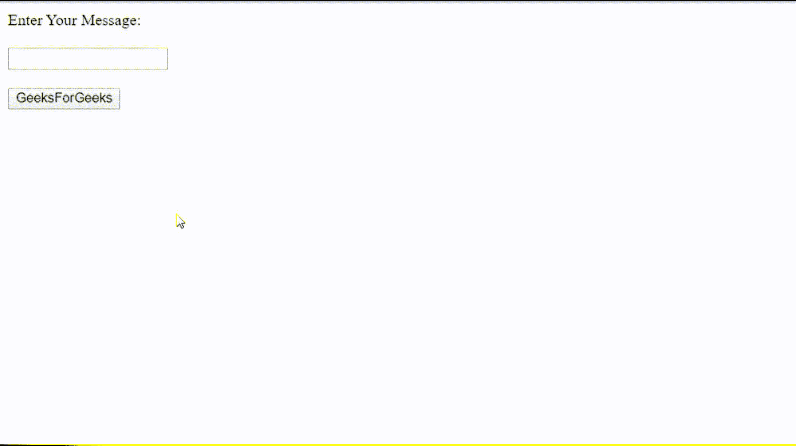

# 如何用 JavaScript 在文本框中点击回车按钮后触发 HTML 按钮？

> 原文:[https://www . geesforgeks . org/how-to-trigger-html-点击后按下按钮-在文本框中输入按钮-使用-javascript/](https://www.geeksforgeeks.org/how-to-trigger-html-button-after-hitting-enter-button-in-textbox-using-javascript/)

给定一个包含文本区域的 HTML 文档，任务是当用户点击输入按钮时触发按钮。根据需要，我们可以在文本框上使用“键上”、“键下”或“键按”事件监听器来实现。当该事件被触发时，我们检查按下的键是否为**回车**。如果按下的键不是**回车**，我们什么也不做。我们将做一个例子，当使用所有三个事件监听器按下**回车**时，在 div 中追加文本框的内容。

*   **按键:当用户释放一个按键时，触发该事件。
    **语法:****

```html
textbox.addEventListner("keyup", FUNCTION);
```

FUNCTION 是事件触发时我们要调用的函数的名称。

**示例:**

## 超文本标记语言

```html
<!DOCTYPE html>
<html lang="en" xmlns="http://www.w3.org/1999/xhtml">

<head>
    <meta charset="utf-8" />
    <title>
        How to trigger HTML button after hitting
        enter button in textbox using JavaScript?
    </title>
</head>

<body>
    <label for="message">Enter Your Message:</label>
    <br><br>

    <!-- Textbox -->
    <input type="text" id="textbox" name="message">
    <br><br>

    <!-- Button we want to trigger on ENTER in Textbox -->
    <button id="button">GeeksForGeeks</button>

    <!-- The div element in which we will
        append our data from text box -->
    <div id="message"></div>

    <script>
        var msg = document.getElementById("message");
        var button = document.getElementById("button");
        var textBox = document.getElementById("textbox");

        // This event is fired when button is clicked
        button.addEventListener("click", function () {
            var str = textBox.value;
            console.log(str);
            msg.innerHTML += "
<p>" + str + "</p>
";
        });

        textBox.addEventListener("keyup", function (event) {

            // Checking if key pressed is ENTER or not
            // if the key pressed is ENTER
            // click listener on button is called
            if (event.keyCode == 13) {
                button.click();
            }
        });
    </script>
</body>

</html>
```

**输出:**



*   **向下键:**当用户按下一个键时，该事件被触发。
    **语法:**

```html
textbox.addEventListner("keydown", FUNCTION);
```

FUNCTION 是事件触发时我们要调用的函数的名称。

**示例:**

## 超文本标记语言

```html
<!DOCTYPE html>
<html lang="en" xmlns="http://www.w3.org/1999/xhtml">

<head>
    <meta charset="utf-8" />
    <title>
        How to trigger HTML button after hitting
        enter button in textbox using JavaScript?
    </title>
</head>

<body>
    <label for="message">Enter Your Message:</label>
    <br><br>

    <!-- Textbox -->
    <input type="text" id="textbox" name="message">
    <br><br>

    <!-- Button we want to trigger on ENTER in Textbox -->
    <button id="button">GeeksForGeeks</button>

    <!-- The div element in which we will
        append our data from text box -->
    <div id="message"></div>

    <script>
        var msg = document.getElementById("message");
        var button = document.getElementById("button");
        var textBox = document.getElementById("textbox");

        // This event is fired when button is clicked
        button.addEventListener("click", function () {
            var str = textBox.value;
            console.log(str);
            msg.innerHTML += "
<p>" + str + "</p>
";
        });

        textBox.addEventListener("keydown", function (event) {

            // Checking if key pressed is ENTER or not
            // if the key pressed is ENTER
            // click listener on button is called
            if (event.keyCode == 13) {
                button.click();
            }
        });
    </script>
</body>

</html>
```

**输出:**


*   **按键:**当用户按键时，该事件被触发。
    **语法:**

```html
textbox.addEventListner("keypress", FUNCTION);
```

FUNCTION 是事件触发时我们要调用的函数的名称。

**示例:**

## 超文本标记语言

```html
<!DOCTYPE html>
<html lang="en" xmlns="http://www.w3.org/1999/xhtml">

<head>
    <meta charset="utf-8" />
    <title>
        How to trigger HTML button after hitting
        enter button in textbox using JavaScript?
    </title>
</head>

<body>
    <label for="message">Enter Your Message:</label><br><br>

    <!-- Textbox -->
    <input type="text" id="textbox" name="message"><br><br>

    <!-- Button we want to trigger on ENTER in Textbox -->
    <button id="button">GeeksForGeeks</button>

    <!-- The div element in which we will
        append our data from text box -->
    <div id="message"></div>

    <script>
        var msg = document.getElementById("message");
        var button = document.getElementById("button");
        var textBox = document.getElementById("textbox");

        // This event is fired when button is clicked
        button.addEventListener("click", function () {
            var str = textBox.value;
            console.log(str);
            msg.innerHTML += "
<p>" + str + "</p>
";
        });

        textBox.addEventListener("keypress", function (event) {

            // Checking if key pressed is ENTER or not
            // if the key pressed is ENTER
            // click listener on button is called
            if (event.keyCode == 13) {
                button.click();
            }
        });
    </script>
</body>

</html>
```

**注意:**两次**按键**和**按键**事件不断重复，直到按键被按下。两者可能会显示类似的结果，但**按键**不会在所有浏览器中检测到所有按键。

**输出:**

