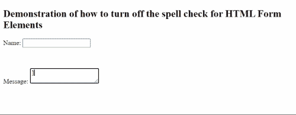

# 如何关闭 HTML 表单元素的拼写检查？

> 原文:[https://www . geesforgeks . org/如何关闭 html 表单元素拼写检查/](https://www.geeksforgeeks.org/how-to-turn-off-spell-checking-for-html-form-elements/)

你可能经常注意到，在任何网站填写表格时，如果我们犯了任何拼写或语法错误，它会被一条红色波浪线划线。这有时会让用户感到烦恼，因为他/她可能会因此而分心。因此，许多网站为用户关闭了**拼写检查功能**。HTML 中的拼写检查功能用于识别用户在表单中输入时犯的语法或拼写错误。在本文中，我们将讨论如何关闭[HTML](https://www.geeksforgeeks.org/html-tutorials/)表单元素的拼写检查功能

**拼写检查**功能可以通过一个名为**拼写检查**的属性**启用/禁用**，该属性定义是否检查 HTML 元素的错误。它需要两个值，要么是**真，要么是**假。当您将该值设为 true 时，它将被打开并检查字段中是否存在任何语法/拼写错误，而当该值设为 false 时，它将被关闭并不会检查任何错误。拼写检查属性支持所有的 HTML 表单元素。

**语法:**

```html
<form spellcheck="value (either true or false)"></form>
```

**对于输入字段**:

```html
<input type="text" spellcheck="value (either true or false)">
```

**对于文本区域字段**:

```html
<textarea type="text" 
    spellcheck="value (either true or false)">
</textarea>
```

现在让我们来看一个**示例**如何通过为其编写 **HTML 代码**来关闭它。

## 超文本标记语言

```html
<!DOCTYPE html>
<html>

<head>
    <title>Turn off Spell Check Feature</title>
</head>

<body>
    <h2>
        Demonstration of how to turn off the 
        spell check for HTML Form Elements
    </h2>

    <form>
        <p>Name: <input type="text" spellcheck="true"></p>

        <br>
        <p>
            Message: <textarea type="text" 
            spellcheck="false"></textarea>
        </p>
    </form>
</body>

</html>
```

**输出:**你可以在两个字段中注意到在第一列的单词下有一条**红色波浪线**显示语法错误，因为拼写检查在这个字段中是真的，而在文本区域**拼写检查是假的**那就是没有红色波浪线没有出现在错误的单词下。

