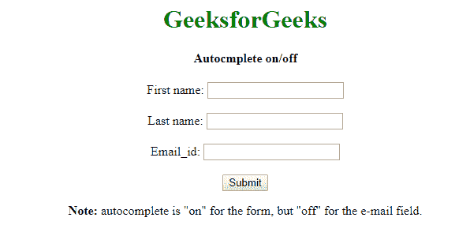

# 如何开启/关闭 HTML 中的表单自动完成？

> 原文:[https://www . geesforgeks . org/how-on-off-form-autocompletion-in-html/](https://www.geeksforgeeks.org/how-to-turn-on-off-form-autocompletion-in-html/)

默认情况下，所有浏览器都会记住用户通过网站上的字段提交的信息。它使浏览器能够提供自动完成功能。默认情况下，该功能通常是启用的，但对于用户来说，这可能是一个隐私问题，因此浏览器可以让用户禁用它们。但是有一点很重要，如果你想创建一个网站，在那里你可以获得用户的姓名、年龄和 email_id 等信息，这些信息默认由浏览器提供。如果您在站点中禁用了自动完成功能，那么您就违反了规则。将**自动完成=“关”**设置为非法。自动完成功能设置为 off 对用户来说可能是安全的，但这违反了规则。

但是对于禁用表单自动完成的测试和知识，您可以将自动完成属性设置为“关”:

**语法:**

```html
autocomplete="on/off"
```

在字段上设置**自动完成=“关”**有两种效果:

*   它告诉浏览器不要保存用户输入的数据，以便以后在类似的表单上自动完成，尽管遵从的试探法因浏览器而异。
*   它阻止浏览器在会话历史中缓存表单数据。当表单数据缓存在会话历史记录中时，用户填写的信息会在用户提交表单并单击“上一步”按钮返回原始表单页面的情况下显示。

**示例:**该示例说明了上述方法。

```html
<!DOCTYPE html>
<html>

<head>
    <title>Autocmplete on/off</title>

    <style>
        h1 {
            color: green;
        }
    </style>
</head>

<body style="text-align:center;">

    <h1 style="color:green;">
        GeeksforGeeks
    </h1>

    <h4>Autocmplete on/off</h4>

    <form action="https://ide.geeksforgeeks.org/tryit.php"
                    autocomplete="on">
        First name: <input type="text" name="fname">

        <br><br> 

        Last name: <input type="text" name="lname">

        <br><br> 

        Email_id: <input type="email" name="email"
                    autocomplete="off">

        <br><br>

        <input type="submit">
    </form>

    <p>
        <b>Note:</b> autocomplete is "on" for the
        form, but "off" for the e-mail field.
    </p>
</body>

</html>
```

**输出:**


**注意:**除了**自动完成=“关闭”**之外，您还可以通过生成页面的代码对表单字段名称进行随机化，或许可以在名称的末尾添加一些特定于会话的字符串。