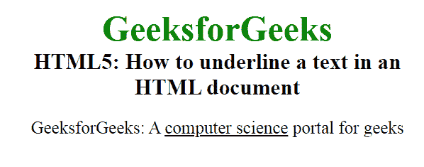
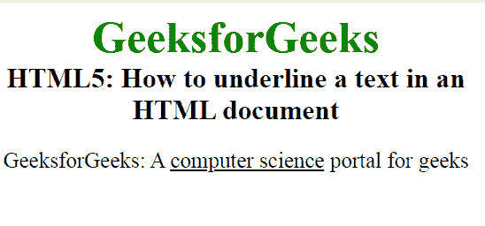

# 如何用 HTML 给文本内容加下划线？

> 原文:[https://www . geeksforgeeks . org/如何使用 html 为文本内容加下划线/](https://www.geeksforgeeks.org/how-to-underline-a-text-content-using-html/)

在本文中，我们将使用文档中的 [**< u >标记**](https://www.geeksforgeeks.org/html-u-tag/) 来创建下划线文本。它代表下划线，用于给包含在 **< u >标签**中的文本加下划线。此标签通常用于给拼写错误的单词加下划线。这个标签需要一个开始和结束标签。
**语法:**

```html
<u> Contents... </u>
```

**示例 1:** 本示例使用< u >标签创建下划线文本。

## 超文本标记语言

```html
<!DOCTYPE html>
<html>

<head>
    <title>
        How to underline a text
        content using HTML?
    </title>

    <style>
        body {
            text-align: center;
        }

        .gfg {
            font-size: 40px;
            font-weight: bold;
            color: green;
        }

        .geeks {
            font-size: 25px;
            font-weight: bold;
        }

        p {
            font-size: 20px;
        }
    </style>
</head>

<body>
    <div class="gfg">
        GeeksforGeeks
    </div>

    <div class="geeks">
        HTML5: How to underline a text
        in an HTML document

<p>
            GeeksforGeeks: A <u>computer
            science</u> portal for geeks
        </p>

</body>

</html>
```

**输出:**



**示例 2:** 这个示例是 **< u >标记**给文本加下划线的替代方式。在这个例子中，我们将使用 [CSS 文本装饰属性](https://www.geeksforgeeks.org/css-text-decoration-property/)来给文本内容加下划线。

## 超文本标记语言

```html
<!DOCTYPE html>
<html>

<head>
    <title>
        How to underline a text
        content using HTML?
    </title>

    <style>
        body {
            text-align: center;
        }

        .gfg {
            font-size: 40px;
            font-weight: bold;
            color: green;
        }

        .geeks {
            font-size: 25px;
            font-weight: bold;
        }

        p {
            font-size: 20px;
        }

        span {
            text-decoration: underline;
        }
    </style>
</head>

<body>
    <div class="gfg">
        GeeksforGeeks
    </div>

    <div class="geeks">
        HTML5: How to underline a
        text in an HTML document

<p>
            GeeksforGeeks: A <span>
            computer science</span>
            portal for geeks
        </p>

</body>

</html>
```

**输出:**



**支持的浏览器:**

*   谷歌 Chrome
*   微软公司出品的 web 浏览器
*   火狐浏览器
*   歌剧
*   旅行队