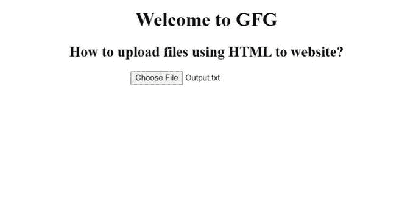

# 如何用 HTML 上传文件到网站？

> 原文:[https://www . geesforgeks . org/如何使用 html 上传文件到网站/](https://www.geeksforgeeks.org/how-to-upload-files-using-html-to-website/)

每个需要上传到网站的文件，都需要方便上传的基本表格。当我们在一个特定的网站上填写表格时，这个功能是必不可少的。此文件上传可能支持各种文件格式以及各种类型的文件。文件上传功能是网站表单的重要组成部分之一。在本文中，我们将学习使用 HTML 在网站中构建文件上传功能。我们将使用 HTML [<的概念输入>标签](https://www.geeksforgeeks.org/html-input-tag/)，这将允许用户上传文件到网站。

**<输入>标签:**用于指定用户可以输入所需数据的输入字段。输入标签在<表单>元素中用于声明允许用户输入数据的输入控件。根据属性类型，输入字段可以是各种类型。输入标签是一个只包含属性的空元素。这里，我们定义了一个*类型*属性，其值被设置为“文件”

**语法:**

```html
<input type = "file"... />
```

此语法指定了文件选择字段，该字段使功能可以从设备存储中选择一个或多个文件，然后使用表单提交按钮将其上传到服务器。

**示例:**本示例通过将*类型*属性指定为文件来说明 **<输入>标记**的用法。

## 超文本标记语言

```html
<!DOCTYPE html>
<html>
<head>
    <title>How to upload files using HTML to website?</title>
</head>

<body>
    <center>
        <h1>Welcome to GFG</h1>
        <h2>How to upload files using HTML to website?</h2>
        <input type="file" 
               id="file1" 
               name="upload">
    </center>
</body>
</html>
```

**输出:**在输出中，可以看到选择文件后上传时，其名称也显示在按钮的右侧。

