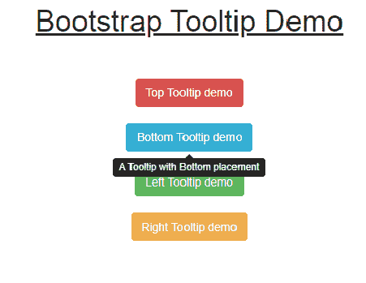
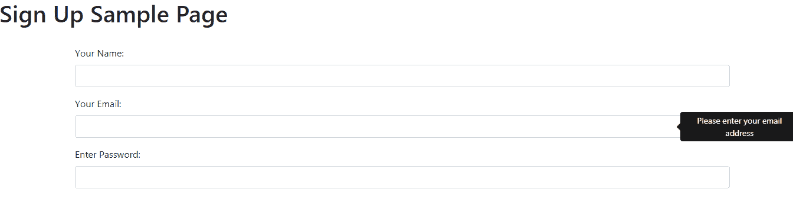

# 如何使用 jQuery 使用带有 twitter Bootstrap 工具提示的复杂 HTML？

> 原文:[https://www . geesforgeks . org/如何使用-复杂-html-with-Twitter-bootstrap-tooltip-using-jquery/](https://www.geeksforgeeks.org/how-to-use-complex-html-with-twitter-bootstrap-tooltip-using-jquery/)

**引导工具提示**以图形方式给我们一个关于特定元素的**提示**。工具提示用于性能原因，因此可以根据需求领域进行定制。Tooltip 是使用 javascript 实现的，它依赖于第三方库 popper.js 来定位。

它基于使用光标指针悬停的概念，当指针悬停在元素上时，可能会按照代码中的指示在任何 4 个方向(左、右、上、下)弹出/出现提示。

**一些一般的例子:**

*   在登录页面中，**密码**工具提示会弹出要求，如长度应为 8 个字符，以大写字母开头等。
*   对于**名字**，可能会弹出只需键入名字，不需要键入中间名或姓。

JavaScript 的片段

```html
// Write Javascript code here
$(function () {
  $('[data-toggle="tooltip"]').tooltip()
})
```

**注意:**使用 HTML、CSS、Bootstrap、JavaScript 和 jQuery。

*   **Method 1: The below implementation is done for 4 buttons left, right, up and down and there respective tooltips which indicate the position of the buttons respectively when the cursor hovers over the buttons.

    ```html
    <!DOCTYPE html>
    <html>

    <head>
        <meta name="viewport" content=
            "width=device-width,initial-scale=1.0" />

        <title>
            HTML with twitter Bootstrap 
            tooltip using jQuery
        </title>

        <link rel="stylesheet" href=
    "https://maxcdn.bootstrapcdn.com/bootstrap/3.3.6/css/bootstrap.min.css"
            integrity=
    "sha384-1q8mTJOASx8j1Au+a5WDVnPi2lkFfwwEAa8hDDdjZlpLegxhjVME1fgjWPGmkzs7"
            crossorigin="anonymous">

        <script src=
    "https://ajax.googleapis.com/ajax/libs/jquery/1.10.2/jquery.min.js">
        </script>

        <script src=
    "https://maxcdn.bootstrapcdn.com/bootstrap/3.3.6/js/bootstrap.min.js"
                integrity=
    "sha384-0mSbJDEHialfmuBBQP6A4Qrprq5OVfW37PRR3j5ELqxss1yVqOtnepnHVP9aJ7xS"
                crossorigin="anonymous">
        </script>

        <script type="text/javascript">
            $(document).ready(function() {
                $("#toptip").tooltip({
                    placement: "top"
                });

                $("#bottomtip").tooltip({
                    placement: "bottom"
                });

                $("#lefttip").tooltip({
                    placement: "left"
                });

                $("#righttip").tooltip({
                    placement: "right"
                });
            });
        </script>
    </head>

    <body>
        <center>

        <div class="container">
            <h1><u>Bootstrap Tooltip Demo</u></h1>

        <br/><br/>

        <div>
            <button type="button" id="toptip"
                    class="btn btn-danger"
                    title="A Tooltip with Top placement">
                Top Tooltip demo
            </button>
            <br><br>

            <button type="button" id="bottomtip"
                    class="btn btn-info"
                    title="A Tooltip with Bottom placement">
                Bottom Tooltip demo
            </button>
            <br><br>

            <button type="button" id="lefttip"
                    class="btn btn-success"
                    title="A Tooltip with Left placement">
                Left Tooltip demo
            </button>
            <br><br>

            <button type="button" id="righttip"
                    class="btn btn-warning"
                    title="A Tooltip with Right placement">
                Right Tooltip demo
            </button>
        </div>
    </body>

    </html>
    ```

    **输出:**
    ** *   ****Method 2:** The Below Implementation is a Sign-up page with tooltips for giving tips/ recommendation. The form tag in the HTML is used to create a form and the tooltip attributes are added accordingly.

    ```html
    <!DOCTYPE html>
    <html>

    <head>
        <title>Bootstrap Grid</title>
        <!-- Latest compiled and minified CSS -->
        <link rel="stylesheet" 
              href=
    "https://maxcdn.bootstrapcdn.com/bootstrap/3.3.1/css/bootstrap.min.css">

        <!-- Optional theme -->
        <link rel="stylesheet" 
              href=
    "https://maxcdn.bootstrapcdn.com/bootstrap/3.3.2/css/bootstrap-theme.min.css">
        <script src=
    "https://ajax.googleapis.com/ajax/libs/jquery/1.11.1/jquery.min.js">
        </script>

        <!-- Latest compiled and minified JavaScript -->
        <script src=
    "https://maxcdn.bootstrapcdn.com/bootstrap/3.3.2/js/bootstrap.min.js">
        </script>

        <script type="text/javascript">
            $(document).ready(function() {
                $('#name').tooltip({
                    'trigger': 'focus',
                    'title': 'Name is Required'
                });

                $('#email').tooltip({
                    'trigger': 'focus',
                    'title': 'Email is Required'
                });

                $('#password').tooltip({
                    'trigger': 'focus',
                    'title': "Password is Required"
                });
            });
        </script>
        <style>
            .serif {
                font-family: "Times New Roman", Times, serif;
            }

            p {
                padding: 20px;
            }
        </style>
    </head>

    <body>
        <h1><p class="serif">Sign Up Sample Page</p></h1>

        <div class="container" style="padding:50px;">

            <form role="form">
                <div class="form-group">
                    <label for="firstname">Name</label>
                    <input type="text" 
                           name="Name"
                           class="form-control" 
                           id="name" 
                           placeholder="Enter Name">
                </div>
                <div class="form-group">
                    <label for="email">Email</label>
                    <input type="text"
                           name="email" 
                           class="form-control" 
                           id="email" 
                           placeholder="Enter email">
                </div>

                <div class="form-group">
                    <label for="Password">Password</label>
                    <input type="password" 
                           name="password"
                           class="form-control" 
                           id="password" 
                           placeholder="Enter Password">
                </div>
            </form>
        </div>
    </body>

    </html>
    ```

    **输出:**
    **