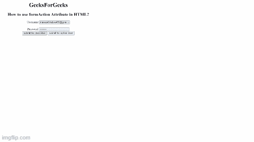
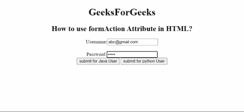

# 如何在 HTML 中使用 formaction 属性？

> 原文:[https://www . geesforgeks . org/how-use-formaction-attribute-in-html/](https://www.geeksforgeeks.org/how-to-use-formaction-attribute-in-html/)

在本文中，我们将学习如何在 HTML 中使用 formaction 属性。基本上，信息属性用于定义在提交表单之后表单的数据发送到哪里，表单的工作将开始。它覆盖了

<form>元素的动作属性的特征。</form>

**我们为什么要使用 formaction Attribute？**

让我们假设，在一个表单中有两个提交按钮，这两个按钮分别工作，并重定向到页面的另一个网址。这两个按钮都将数据发送到不同的页面。

**值:**包含发送表单数据的文件位置的物理地址。

**两个可通过的值是–**

*   **绝对 URL:** 它指向一个页面的完整地址。例如“www . geeksforgeeks . org/data-structure”
*   **相对 URL:** 用于指向网页内的文件。例如 gfg.php

**示例:**

## 超文本标记语言

```html
<!DOCTYPE html>
<html>

<head>
    <title>
        How to use formAction Attribute im HTML ?
    </title>
</head>

<body style="text-align:center;">
    <h1>
        GeeksForGeeks
    </h1>

    <h2>
        How to use formAction Attribute in HTML?
    </h2>

    <form method="get" target="_self">
        Username:<input type="email" name=ename""><br><br>
        Password <input type="password" name="passwrd"><br>

        <input type="submit" value="submit for Java User" 
            formaction=
"https://practice.geeksforgeeks.org/courses/java-backend-live">

        <input type="submit" value="submit for python User"
            formaction=
"https://www.geeksforgeeks.org/python-programming-language/">
    </form>
</body>

</html>
```

**输出**

*   **点击**后**提交为 Java 用户按钮:**



*   **点击 python 用户提交按钮后:**

