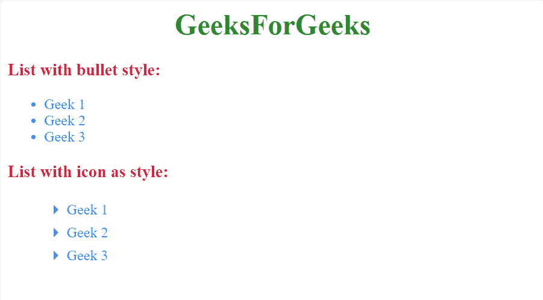

# 如何在使用 HTML 和 CSS 的网页中使用谷歌素材图标作为列表样式？

> 原文:[https://www . geesforgeks . org/如何使用-Google-material-icon-as-list-style-in-a-web-use-html-and-CSS/](https://www.geeksforgeeks.org/how-to-use-google-material-icon-as-list-style-in-a-webpage-using-html-and-css/)

图标可以从图标库中添加到我们的 HTML 页面中。库中的所有图标都可以使用 CSS 进行格式化。它们可以根据尺寸、颜色、阴影等进行定制。他们在物化 CSS 中扮演了一个体贴的角色。物化 CSS 提供了丰富的谷歌材质图标，可以从 [**【材质设计规格】**](https://material.io/resources/icons/?style=baseline) 下载。

**库和用法:**要使用这些图标，在 HTML 代码的<头>部分添加了以下一行。

## 超文本标记语言

```html
<link href="https://fonts.googleapis.com/icon?family=Material+Icons" rel="stylesheet">
```

然后要使用图标，在 HTML 元素的*部分提供图标的名称。*

```html
<i class="material-icons">add</i>
```

要了解关于物化 CSS 的更多信息，请阅读下面的文章:

[物化 CSS 图标](https://www.geeksforgeeks.org/materialize-css-icons/)在本文中，我们将学习如何使用这些图标作为列表样式。

*   首先，我们通过将 [**列表样式类型**](https://www.geeksforgeeks.org/css-list-style-type-property/) 设置为**无**来移除默认列表样式。

    ## 超文本标记语言

    ```html
    <style>
      ul{
          list-style-type: none;
      }
    </style>
    ```

*   然后我们将使用 **li:在**样式之前，在列表值之前添加内容，并添加材质图标作为内容。

    ## 超文本标记语言

    ```html
    <style>
      li:before{
        content: 'arrow_right';
        font-family: 'Material Icons';
      }
    </style>
    ```

此样式将向所有列表内容添加右箭头图标。

**最终代码:**

## 超文本标记语言

```html
<!DOCTYPE> 
<html> 
<head>
    <!-- Google Material Icon Script -->
    <link 
        rel="stylesheet" href=
"https://fonts.googleapis.com/icon?family=Material+Icons">

    <style>
        /* Removing the list style of list gfg */
        .gfg{
            list-style-type:none;
        }

        /* Adding icon before each list icon */
        .gfg > li:before{
            content: 'arrow_right';
            font-family: 'Material Icons';
            font-size: 25px;
            vertical-align: -30%;
        }
    </style>
</head> 
<body> 
    <center>
        <h1 style="color:forestgreen;"> 
            GeeksForGeeks
        </h1> 
    </center>

    <!-- This is a list with bullet style -->
    <h3 style="color:crimson;">
        List with bullet style:
    </h3>

    <ul style="color:dodgerblue;">
        <li>Geek 1</li>
        <li>Geek 2</li>
        <li>Geek 3</li>
    </ul> 

    <!-- This is the list with icon as its style -->
    <h3 style="color:crimson;">
        List with icon as style:
    </h3>

    <ul class="gfg" style="color:dodgerblue;">
        <li>Geek 1</li>
        <li>Geek 2</li>
        <li>Geek 3</li>
    </ul> 
</body> 
</html>
```

**输出:**

