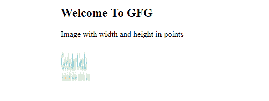
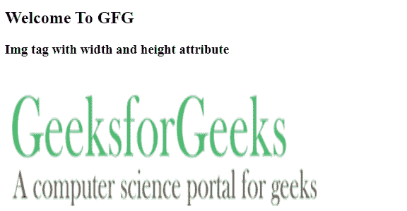
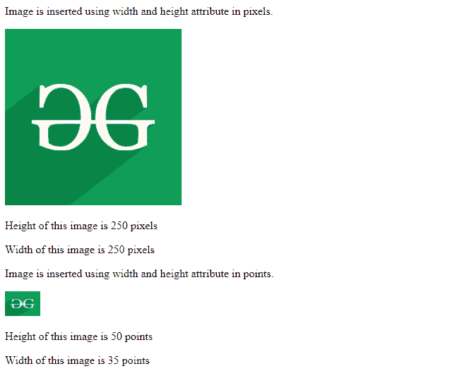

# 如何在 HTML 页面中使用图像高度和宽度属性？

> 原文:[https://www . geesforgeks . org/如何使用-html 页面中的图像高度和宽度属性/](https://www.geeksforgeeks.org/how-to-use-image-height-and-width-attribute-in-html-page/)

[**HTML**](https://www.geeksforgeeks.org/html-tutorials/) 代表超文本标记语言。超文本定义了在线页面之间的链接。它用于定义标签内的文本文档，标签定义了网站的结构。这种语言用于注释文本，以便机器能够知道它并相应地操作文本。大多数标记语言(如超文本标记语言)是人类可读的。这种语言使用标签来定义需要对文本进行什么操作。

要在 HTML 页面中添加图像，需要使用 [< img >](https://www.geeksforgeeks.org/html-img-tag/) 标签。这样，我们需要使用属性的宽度和像素的图像高度。指定这两个属性。

**语法:**

```html

```

**属性:**

*   **src:***src*代表源头。每个图像都有一个 *src* 属性，它告诉浏览器在哪里可以找到你想要显示的图像。提供的图像的 URL 指向存储图像的位置。
*   **alt:** 如果图像无法显示，则 *alt* 属性充当图像的替代描述。 *alt* 属性的值是用户定义的文本。

**设置图像的宽度和高度:**[*宽度*](https://www.geeksforgeeks.org/html-input-width-attribute/) 和 [*高度*](https://www.geeksforgeeks.org/html-img-height-attribute/) 属性用于指定图像的宽度和高度。默认情况下，属性值以像素为单位指定。

**语法:**

```html

```

**注:**

*   **像素:像素–**像素(1px = 1 英寸的 1/96)
*   **英寸:英寸–**英寸(1 英寸= 96px = 2.54cm 厘米)
*   **pt:分–**分(1pt = 1 英寸的 1/72)

**示例 1:** 高度为 600 像素、宽度为 500 像素的图像。*宽度*属性指定图片的宽度，以磅为单位。

## 超文本标记语言

```html
<!DOCTYPE html>
<html>

<body>
    <h2>Welcome To GFG</h2>

<p>Image with width and height in points</p>

    
</body>

</html>
```

**输出:**



**示例 2:** 另一个示例展示[宽度](https://www.geeksforgeeks.org/html-img-width-attribute/)和[高度](https://www.geeksforgeeks.org/html-img-height-attribute/)属性的使用。我们提到宽度为 450 像素，高度为 220 像素。

## 超文本标记语言

```html
<!DOCTYPE html>
<html>

<body>
    <h2>Welcome To GFG</h2>
    <h3>img tag with width and height attribute</h3>
    
</body>

</html>
```

**输出:**



**示例 3:** 另一个 HTML 程序展示了使用 [< img >](https://www.geeksforgeeks.org/html-img-tag/) 标签的*宽度*和*高度*属性。在这段代码中，我们将*高度*和*宽度*的值取为 250 像素。

## 超文本标记语言

```html
<!DOCTYPE html>
<html>

<head>
    <title>
        Setting width and height 
        attribute of image
    </title>
</head>

<body>
    <p> 
        Image is inserted using width and 
        height attribute in pixels.
    </p>

    

<p>Height of this image is 250 pixels</p>

<p>Width of this image is 250 pixels</p>

    <p>
        Image is inserted using width and 
        height attribute in points.
    </p>

    

    <p>Height of this image is 50 points</p>
    <p>Width of this image is 35 points</p>
</body>

</html>
```

**输出:**

