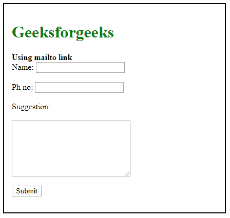
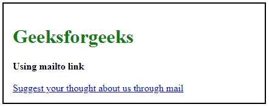

# 如何在 HTML 中使用 mailto？

> 原文:[https://www.geeksforgeeks.org/how-to-use-mailto-in-html/](https://www.geeksforgeeks.org/how-to-use-mailto-in-html/)

在这篇文章中，我们将学习如何用 HTML 邮件链接发送邮件。 **Mailto** 链接是消费者想要沟通或者想要反馈时默认的发送邮件方式，然后点击 **mailto** 链接会打开默认的发送邮件窗口。所以我们可以使用**邮件到**，一旦表单提交，它会指引我们到邮件。使用 **mailto** 我们可以设置表单的动作字段，在这种情况下，web 浏览器调用电子邮件客户端将表单提交发送到指定的电子邮件地址。此外，我们还可以附上抄送、密件抄送、主题和正文内容。

**语法:**

```html
<form  method="POST" action="mailto: name@gmail.com"
          enctype="multipart/form-data">
```

**参数:**该属性接受七个参数，如下所述:

*   **mailto:** 此参数保存邮件收件人地址 mail。
*   **cc:** 此参数保存另一封将收到邮件复件的邮件，可选。
*   **密件抄送:**此参数保存另一封将接收邮件的盲复件的邮件，可选。
*   **主题:**此参数保存邮件的主题，可选。
*   **正文:**此参数保存邮件内容，可选。
*   **？:**此参数为第一个参数分隔符，可选。
*   **@:** 这个保存其他参数分隔符，可选。

**方法:**为了将邮件发送到指定的邮件地址，我们将使用 mailto &设置表单的操作字段，网络浏览器将调用电子邮件客户端将表单提交发送到指定的电子邮件地址。点击邮件链接，它将打开一个默认的发送邮件窗口，而不必复制它并输入到电子邮件客户端。

下面的例子说明了 HTML 中**邮件到**链接的使用。

**示例 1:** 在本例中，我们使用了 HTML 表单作为姓名、联系电话&文本区提交建议。

## 超文本标记语言

```html
<!DOCTYPE html>
<html>
<head>
    <title>Using mailto link</title>
    <style>
    h1 {
        color: green;
    }

    .container {
        width: 400px;
        border: 2px solid black;
        padding: 15px;
    }
    </style>
</head>

<body>
    <div class="container">
        <h1>Geeksforgeeks</h1>
        <b>Using mailto link</b>
        <form method="POST"
              action=
    "mailto: geeksforgeeks@gmail.com"
              enctype="multipart/form-data">
            <div class="control">
                Name:
                    <input aria-required=""
                        id="name"
                        type="text" />
            </div>
            <br>
            <div class="control">
                 Ph no:
                <input aria-required=""
                       id="mobile_number"
                       type="tel" />
            </div>
            <br>
            <div class="control">
                Suggestion:
                <textarea rows="7"
                          cols="30"
                          name="comment">
                </textarea>
            </div>
            <br>
            <div class="control">
                <input type="submit"
                       value="Submit" />
            </div>
        </form>
    </div>
</body>
</html>
```

**输出:**



**示例 2:** 这个示例说明了如何使用 mailto 链接通过 HTML 中的邮件提交反馈表单。

## 超文本标记语言

```html
<!DOCTYPE html>
<html>
<head>
    <title>Using mailto link</title>
    <style>
    h1 {
        color: green;
    }

    .container {
        width: 400px;
        border: 2px solid black;
        padding: 15px;
    }
    </style>
</head>

<body>
    <div class="container">
        <h1>Geeksforgeeks</h1>
        <b>Using mailto link</b><br>
        <a href="mailto:geeksforgeeks@gmial.com?
                 cc=gfg@gmail.com&
                 bcc=geeks@gmail.com
                 &subject=Feedback from the geeks
                 &body=Add what you want to suggest">
            Suggest your thought
            about us through mail
        </a>
    </div>
</body>
</html>
```

**输出:**

