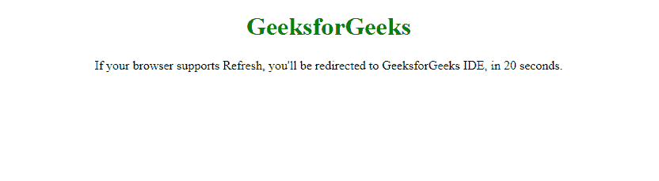
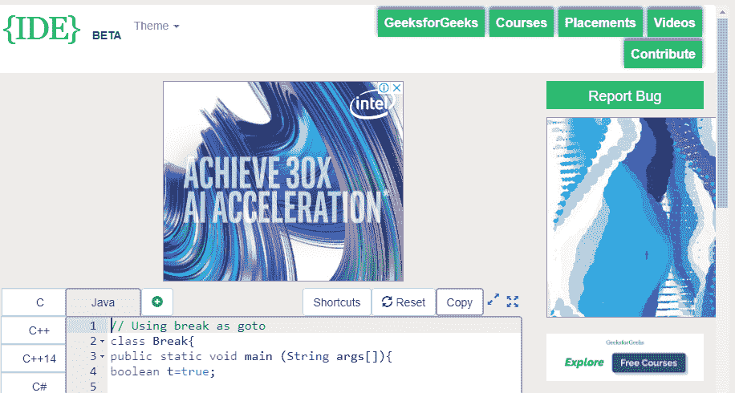

# 如何使用 Meta Tag 重定向一个 HTML 页面？

> 原文:[https://www . geeksforgeeks . org/如何使用-meta-tag-to-redirect-an-html-page/](https://www.geeksforgeeks.org/how-to-use-meta-tag-to-redirect-an-html-page/)

网址重定向，也称为网址转发，是一种将用户发送到不同于他们最初请求的网址的方法。三种最常用的重定向是 301、302 和元刷新。
元刷新重定向是客户端重定向。与发生在网络服务器上的 301 和 302 重定向不同，元刷新重定向发生在网络浏览器中，并指示网络浏览器在指定的时间跨度后转到不同的网页。
使用 Meta Refresh Redirect 是不赞成的，或者换句话说，是 W3C(万维网联盟)不赞成的，因为这是一个非标准的重定向过程，会让用户迷失方向，还会破坏浏览器的访问页面历史。

**语法:**

```html
<meta http-equiv = "refresh" content = "20; url = https://ide.geeksforgeeks.org"/>

```

**示例:**

```html
<!DOCTYPE html>
<html>

<head>
    <title>Meta Refresh Redirection</title>
    <meta http-equiv="refresh" 
          content="20; url = https://ide.geeksforgeeks.org" />
</head>

<body>
    <h1 style="text-align:center;color:green;">
      GeeksforGeeks
  </h1>
    <p style="text-align:center;"> 
      If your browser supports Refresh,
      you'll be redirected to GeeksforGeeks 
      IDE, in 20 seconds. </p>
</body>

</html>
```

**输出:**
**前:**

**后:**
