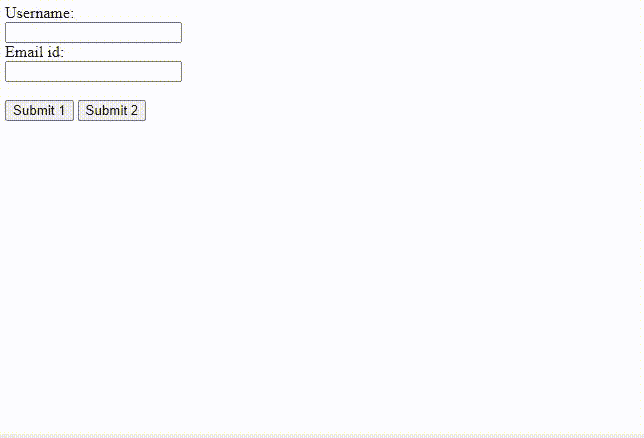

# 如何在一个 HTML 表单中使用多个提交按钮？

> 原文:[https://www . geeksforgeeks . org/使用方法-html 表单中的多个提交按钮/](https://www.geeksforgeeks.org/how-to-use-multiple-submit-buttons-in-an-html-form/)

每个 HTML 表单都用一个动作属性来处理服务器端。HTML 操作属性用于指定表单提交后表单数据发送到服务器的位置。因为我们数据的目的地存储在动作属性中，所以每个按钮都将引导我们到相同的位置。为了克服这个困难，我们必须使用 HTML 输入和按钮的[形式属性](https://www.geeksforgeeks.org/html-formaction-attribute/)。

**方法:**form action 属性用于指定将表单的数据发送到哪里。提交表单后，会调用 formaction 属性。表单数据将在表单提交后发送到服务器。它覆盖了<表单>元素的动作属性的特征。我们将使用这个“formaction”属性来实现我们的问题

让我们学习在单个 HTML 表单中使用多个按钮执行多个操作的步骤:

*   使用方法“post”创建表单，并将 action 属性的值设置为要发送表单数据的默认 URL。
*   根据您的需要在中创建输入字段。
*   创建一个提交类型的按钮。该按钮将触发表单的默认操作属性，并将我们的输入数据发送到该 URL。
*   用提交类型创建另一个按钮。另外，给这个按钮添加一个“**表单**属性，并在点击这个按钮时给它一个你想要发送表单数据的辅助网址的值。
*   formaction 属性将覆盖表单的 action 属性，并将数据发送到所需的位置。

#### 语法:

```html
<form action="/DEFAULT_URL" method="post">
  <!-- Input fields here -->

  <!-- This button will post to the 
  /DEFAULT_URL of the form-->
  <button type="submit">BUTTON 1</button>

  <!-- This button will post to the custom 
  URL of the formaction attribute-->
  <button type="submit" formaction="/URL2">
    BUTTON 2
  </button>
</form>
```

#### 示例:

## 超文本标记语言

```html
<!DOCTYPE html>
<html lang="en">

<body>
    <form action="https://gfg.com/" method="post">
        Username:<br>
        <input type="text" name="username">
        <br>
        Email id:<br>
        <input type="text" name="email_id">
        <br><br>

        <button type="submit" formaction="#">
            Submit 1
        </button>

        <button type="submit" formaction="#">
            Submit 2
        </button>
    </form>
</body>

</html>
```

#### 输出:

