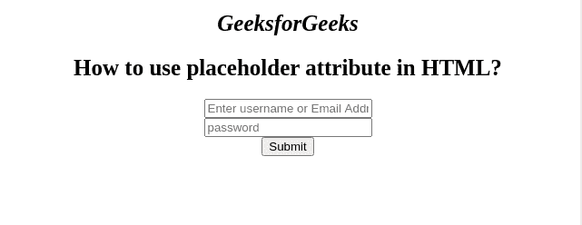

# 如何在 HTML 中使用占位符属性？

> 原文:[https://www . geesforgeks . org/如何使用-html 中的占位符属性/](https://www.geeksforgeeks.org/how-to-use-placeholder-attribute-in-html/)

我们知道**占位符**属性用于定义必须在输入和文本区域字段中输入什么值的提示。该属性用于更好地理解表单结构。它包含一个字符串值，表示描述输入字段/文本区域的预期值的简短提示。在用户输入值之前，短提示会显示在字段中。此属性用于更好地了解特定字段中必须输入的数据类型。

可用于<input>和<textarea>元素。</textarea>

**语法:**

```html
<element placeholder="">
```

**示例:**以下示例说明了占位符属性的使用。

## 超文本标记语言

```html
<!DOCTYPE html>
<html>

<body>
    <center>
        <h1 style="font-size:25px;
                   font-style:italic;">
            GeeksforGeeks
        </h1>

        <h2 style="font-size:25px; 
                   font-family;Impact">
            How to use placeholder attribute in HTML?
        </h2>

        <form action=" ">
            <input type="text" name="Ename" 
                placeholder="Enter username or Email Address">
            <br>

            <input type="Password" name="lname" 
                placeholder="password">
            <br>

            <input type="submit" value="Submit">
        </form>
    </center>
</body>

</html>
```

**输出:**

