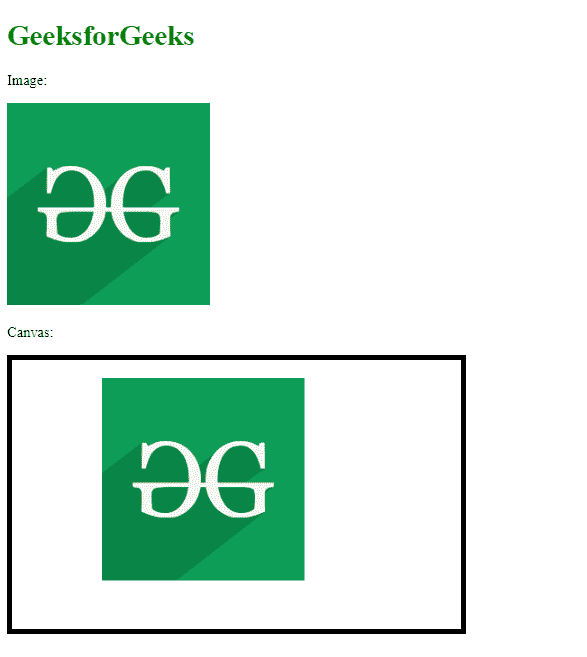

# 如何在 HTML5 中使用画布 drawImage()方法？

> 原文:[https://www . geesforgeks . org/如何使用画布-draw image-method in-html 5/](https://www.geeksforgeeks.org/how-to-use-the-canvas-drawimage-method-in-html5/)

画布 2D 应用编程接口的**画布绘制图像()**方法用于在画布元素上以各种方式绘制图像。此方法具有附加参数，可用于显示图像或图像的一部分。

**语法:**

```html
context.drawImage(img, x, y, swidth, sheight, sx, sy, width, height);

```

**进场:**

*   使用标签添加图像。
*   使用

    <canvas>标记绘制画布。</canvas>

*   加载画布并获取上下文。
*   选择要使用的图像，
*   如果需要，绘制图像以及其他可选参数。

**示例 1:** 在该示例中，使用附加参数设置图像在画布中的位置。

## 超文本标记语言

```html
<!DOCTYPE html>
<html>

<body>
    <h1 style="color: green;">
        GeeksforGeeks
    </h1>

    <p>Image:</p>

    

    <p>Canvas:</p>

    <canvas id="myGFGCanvas" width="500" height="300" 
        style="border: 5px solid black">
    </canvas>

    <script>
        window.onload = function () {

            // Get the canvas element from the page
            var canvas = document.getElementById("myGFGCanvas");

            // Get the 2D context of the canvas
            var ctx = canvas.getContext("2d");

            // Get the image to be drawn on the canvas
            var image = document.getElementById("gfg_image");

            // Draw the image using drawImage() function

            // The first parameter is the image to be drawn

            // The second and third parameter is the
            // x and y position of the image in the canvas
            ctx.drawImage(image, 100, 20);
        }; 
    </script>
</body>

</html>
```

**输出:**



**示例 2:** 在该示例中，使用附加参数来设置图像的位置和尺寸。

## 超文本标记语言

```html
<!DOCTYPE html>
<html>

<body>
    <h1 style="color: green;">
        GeeksforGeeks
    </h1>

    <p>Image:</p>

    

    <p>Canvas:</p>

    <canvas id="myGFGCanvas" width="500" height="300" 
        style="border: 5px solid black">
    </canvas>

    <script>
        window.onload = function () {

            // Get the canvas element from the page
            var canvas = document.getElementById("myGFGCanvas");

            // Get the 2D context of the canvas
            var ctx = canvas.getContext("2d");

            // Get the image to be drawn on the canvas
            var image = document.getElementById("gfg_image");

            // Draw the image using drawImage() function

            // The first parameter is the image to be drawn

            // The second and third parameter is the
            // x and y position of the image in the canvas

            // The fourth and fifth parameter is the
            // width and height of the image to be drawn
            // in the canvas
            ctx.drawImage(image, 20, 20, 400, 200);
        }; 
    </script>
</body>

</html>
```

**Output:**
