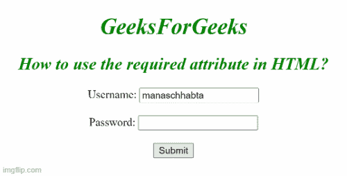

# 如何在 HTML 中使用需要的属性？

> 原文:[https://www . geesforgeks . org/如何使用 html 中所需的属性/](https://www.geeksforgeeks.org/how-to-use-the-required-attribute-in-html/)

**HTML** 引入了许多增强表单的特性。在引入所需属性之前，我们使用 JavaScript 代码强制在提交表单之前必须填写特定的输入字段。

现在，只要使用[所需的属性](https://www.geeksforgeeks.org/html-required-attribute/)，这个过程就很容易了。此属性用于指定提交表单前必须填写的输入元素。如果用户忘记并跳过特定的字段，然后单击提交按钮，它会在所需输入字段的正下方显示弹出窗口。

**语法**

```html
<input type="text" required>
```

**示例:**下面的代码演示了在 HTML 中所需属性的使用。

## 超文本标记语言

```html
<!DOCTYPE html>
<html>

<head>
    <title>
        How to use the required attribute in HTML?
    </title>

    <style>
        h1,
        h2 {
            color: green;
            font-style: italic;
        }

        body {
            text-align: center;
        }
    </style>
</head>

<body>
    <h1>GeeksForGeeks</h1>

    <h2>
        How to use the required 
        attribute in HTML?
    </h2>

    <form action="">
        Username:
        <input type="text" name="usrname">
        <br><br>

        Password:
        <input type="password" name="password" required>

        <br> <br>
        <input type="submit">
    </form>
</body>

</html>
```

**输出:**

