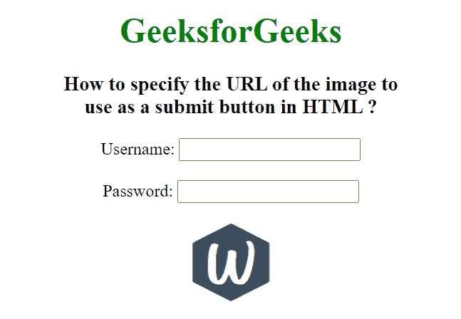

# 如何在 HTML 中使用图片的 URL 作为提交按钮？

> 原文:[https://www . geesforgeks . org/如何使用 URL-图片即提交按钮-在 html 中/](https://www.geeksforgeeks.org/how-to-use-url-of-the-image-as-a-submit-button-in-html/)

HTML <input>类型属性用于指定要显示的<input>元素的类型。<input>类型属性的默认类型是文本。在本文中，我们将图像设置为按钮值。它创建图像作为提交按钮。

**语法:**

```html
<input type="image">
```

**属性值:**

*   **图像:**用于定义图像为提交按钮。

**示例:**

## 超文本标记语言

```html
<!DOCTYPE html>
<html>

<head>
    <title>
        How to specify the URL of
        the image to use as a
        submit button in HTML ?
    </title>
</head>

<body style="text-align:center;">

    <h1 style="color:green;">
        GeeksforGeeks
    </h1>

    <h3>
        How to specify the URL of
        the image to<br> use as a
        submit button in HTML ?
    </h3>

    <form action="#" method="get">
        Username: <input type="text" name="uname">

        <br><br>

        Password: <input type="password" name="pwd">

        <br><br>
        <input type="image" src="logo.PNG" 
            alt="submit" width="75" height="75">
    </form>
</body>

</html>
```

**输出:**

