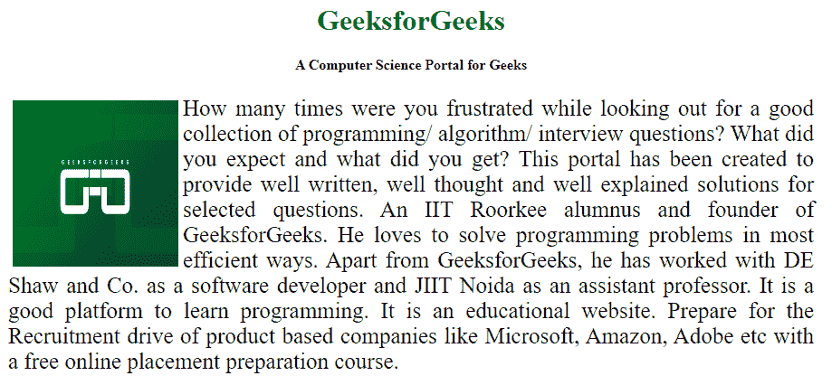
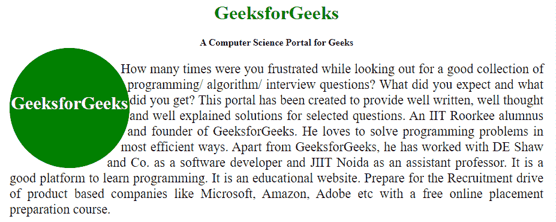

# 如何使用 HTML 和 CSS 将文本环绕在图像周围？

> 原文:[https://www . geesforgeks . org/如何使用 html 和 css 将文本环绕在图像上/](https://www.geeksforgeeks.org/how-to-wrap-the-text-around-an-image-using-html-and-css/)

对于任何类型的网站来说，将文本环绕在图像周围都很有吸引力。现在图像可以是不同的形状或者基本的正方形。我们必须用文本包装图像。通过使用 HTML 和 CSS，用文本包装图像是可能的，而且有很多方法可以做到，因为任何图像的形状都不是恒定的。环绕文本意味着在图像周围调整/环绕文本。在 HTML 中，我们可以将图像对齐在文本的右侧，或者向左，或者居中。在 CSS 中，除了这些，我们还可以插入圆形或矩形等图像。并且可以将文本环绕起来。你也可以使用 [**CSS 形状-属性外**](https://www.geeksforgeeks.org/css-shape-outside-property/) 取决于你的图像的形状。
以下示例说明了上述方法:
**示例 1:** 在本例中，图像浮动在屏幕右侧，文本环绕图像。在这个例子中，我们不需要形状外部属性，因为形状图像是普通的(正方形)。

## 超文本标记语言

```html
<!DOCTYPE html>
<html>

<head>
    <title>
        Wrapping an Image with the text
    </title>

    <style>
        body {
            margin: 20px;
            text-align: center;
        }
        h1 {
            color: green;
        }
        img {
            float: left; 
            margin: 5px;
        }
        p {
            text-align: justify;
            font-size: 25px;
        }
    </style>
</head>

<body>
    <h1>GeeksforGeeks</h1>

    <b>
        A Computer Science
        Portal for Geeks
    </b>

    <div class="square">
        <div> 
             
        </div>

<p>
            How many times were you frustrated while looking
            out for a good collection of programming/algorithm
            /interview questions? What did you expect and what
            did you get? This portal has been created to
            provide well written, well thought and well
            explained solutions for selected questions.
            An IIT Roorkee alumnus and founder of GeeksforGeeks.
            He loves to solve programming problems in most
            efficient ways. Apart from GeeksforGeeks, he has
            worked with DE Shaw and Co. as a software developer 
            and JIIT Noida as an assistant professor. It is a
            good platform to learn programming. It is an
            educational website. Prepare for the Recruitment
            drive of product based companies like Microsoft,
            Amazon, Adobe etc with a free online placement
            preparation course.
        </p>

    </div>
</body>

</html>
```

**输出:**



**示例 2:** 在本例中，我们将包装不同形状的图像，这里我们将使用 CSS shape-out 属性来获得更好的观看体验。

## 超文本标记语言

```html
<!DOCTYPE html>
<html>

<head>
    <title>
        Wrapping an Image with the text
    </title>

    <style>
        body {
            margin: 20px;
            text-align:center;
        }
        h1 {
            color: green;
        }

        /* This div design part is
            used as an Image */
        .round {
            width: 200px;
            height: 200px;
            border-radius: 50%;
            text-align: center;
            font-size: 30px;
            float: left;
            font-weight: bold;

            /* Change the shape according
                to the image */
            shape-outside: circle();
            background-color: Green;
            color: white;
        }

        article{
            padding-top: 75px;
            display: inline-block;
        }

        p {
            text-align: justify;
            font-size: 22px;
        }
    </style>
</head>

<body>
    <h1>GeeksforGeeks</h1>

    <b>
        A Computer Science Portal for Geeks
    </b>

    <div class="round">
        <article>GeeksforGeeks</article>
    </div>

<p>
        How many times were you frustrated while looking
        out for a good collection of programming/
        algorithm/ interview questions? What did you
        expect and what did you get? This portal has been
        created to provide well written, well thought and
        well explained solutions for selected questions.
        An IIT Roorkee alumnus and founder of
        GeeksforGeeks. He loves to solve programming
        problems in most efficient ways. Apart from
        GeeksforGeeks, he has worked with DE Shaw and
        Co. as a software developer and JIIT Noida as
        an assistant professor. It is a good platform
        to learn programming. It is an educational
        website. Prepare for the Recruitment drive of
        product    based companies like Microsoft, Amazon,
        Adobe etc with a free online placement
        preparation course.
    </p>

</body>

</html>
```

**输出:**



HTML 是网页的基础，通过构建网站和网络应用程序用于网页开发。您可以通过以下 [HTML 教程](https://www.geeksforgeeks.org/html-tutorials/)和 [HTML 示例](https://www.geeksforgeeks.org/html-examples/)从头开始学习 HTML。

CSS 是网页的基础，通过设计网站和网络应用程序用于网页开发。你可以通过以下 [CSS 教程](https://www.geeksforgeeks.org/css-tutorials/)和 [CSS 示例](https://www.geeksforgeeks.org/css-examples/)从头开始学习 CSS。