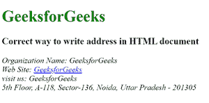

# 如何在 HTML 文档中写地址？

> 原文:[https://www . geesforgeks . org/如何在 html 文档中写入地址/](https://www.geeksforgeeks.org/how-to-write-address-in-an-html-document/)

HTML 中的

<address>标签用来写一个人或者一个组织的联系方式。如果在标签内使用

<address>标签，则它代表文档的联系信息，如果在

<article>标签内使用

<address>标签，则它代表物品的联系信息。

<address>标签内的文本将以斜体格式显示。一些浏览器在地址元素前后添加了换行符。</address>

</address>

</article>

</address>

</address>

**语法:**

```html
<address> Contect Information... </address>

```

**示例:**

## 超文本标记语言

```html
<!DOCTYPE html>
<html>

<head>
    <title>
        What is the correct way to write
        address in an HTML document?
    </title>
</head>

<body>
    <h1 style="color:green;">GeeksforGeeks</h1>

    <h3>
        Correct way to write address
        in HTML document
    </h3>
    <!-- address tag starts from here -->
    <address>
        Organization Name: GeeksforGeeks <br>
        Web Site:
        <a href="https://www.geeksforgeeks.org/about/contact-us/">
            GeeksforGeeks</a><br>
        visit us: GeeksforGeeks<br>
        5th Floor, A-118,
        Sector-136, Noida,
        Uttar Pradesh - 201305
    </address>
    <!-- address tag ends here -->

</body>

</html>
```

**输出:**



**支持的浏览器:**

*   谷歌 Chrome
*   微软公司出品的 web 浏览器
*   火狐浏览器
*   歌剧
*   旅行队