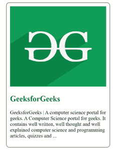

# 如何用 HTML 文档写文章？

> 原文:[https://www . geesforgeks . org/how-write-in-articles-html-document/](https://www.geeksforgeeks.org/how-to-write-articles-in-html-document/)

<article>标签是 HTML5 中新的切片元素之一。HTML article 标签用来表示一篇文章。更具体地说，

<article>标签中的内容独立于网站的其他内容(即使它可能是相关的)。</article>

</article>

换句话说，article 元素表示由文档、页面或站点中的自包含组合组成的页面的组件。对于 Ex。在辛迪加。

**语法:**

```html
<article> Contents. . . </article>

```

**示例:**

## 超文本标记语言

```html
<!DOCTYPE html>
<html>

<head>
    <style>
        article {
            width: 300px;
            border: 2px solid gray;
            padding: 10px;
            border-radius: 10px;
            margin: 0 auto;
        }

        h1 {
            color: green;
        }
    </style>
</head>

<body>
    <article>
        

        <h1>GeeksforGeeks</h1>

<p>
            GeeksforGeeks | A computer science
            portal for geeks. A Computer Science
            portal for geeks. It contains well
            written, well thought and well
            explained computer science and
            programming articles, quizzes and ...
        </p>

    </article>
</body>

</html>
```

输出:



**支持的浏览器:**

*   谷歌 Chrome 6.0
*   Internet Explorer 9.0
*   Firefox 4.0
*   歌剧 11.1
*   Safari 5.0