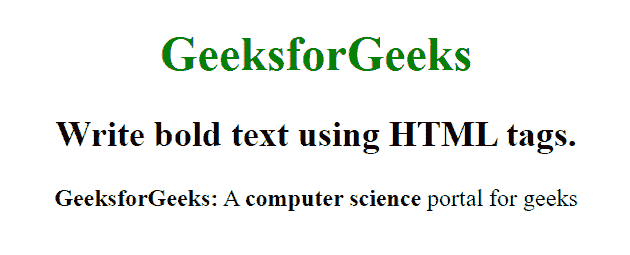

# 如何用 HTML 写出加粗的文字？

> 原文:[https://www . geeksforgeeks . org/如何使用 html 编写粗体文本/](https://www.geeksforgeeks.org/how-to-write-bold-text-using-html/)

在本文中，我们将通过使用文档中的**标签来用 HTML 编写粗体文本。它用来表示文本的重要性。文本以粗体显示在**标签内。你也可以通过使用 CSS 做同样的事情，还有一个类似的标签**标签，对内容有类似的效果。******

**语法:**

```html
<b> Contents... </b>
```

**示例:**

```html
<!DOCTYPE html>
<html>

<head>
    <title>
        Write bold text 
        using HTML tags
    </title>

    <style>
        body {
            text-align: center;
        }

        h1 {
            color: green;
        }
    </style>
</head>

<body>
    <h1>GeeksforGeeks</h1>
    <h2>
        Write bold text 
        using HTML tags.
    </h2>

    <p>
        <b>GeeksforGeeks:</b> A 
        <b>computer science</b>
        portal for geeks
    </p>
</body>

</html>                
```

**输出:**


**使用 CSS:** 使用[字体粗细](https://www.geeksforgeeks.org/css-font-weight-property/) CSS 属性使文本内容加粗。
**例:**

```html
b { 
    font-weight: bold; 
} 
```

**支持的浏览器:**

*   谷歌 Chrome
*   微软公司出品的 web 浏览器
*   火狐浏览器
*   歌剧
*   旅行队